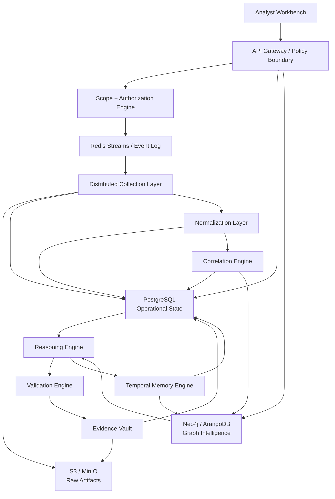
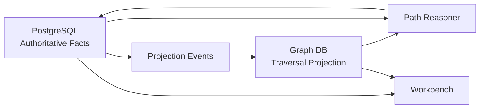
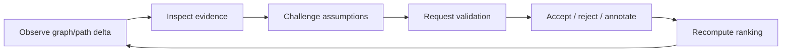
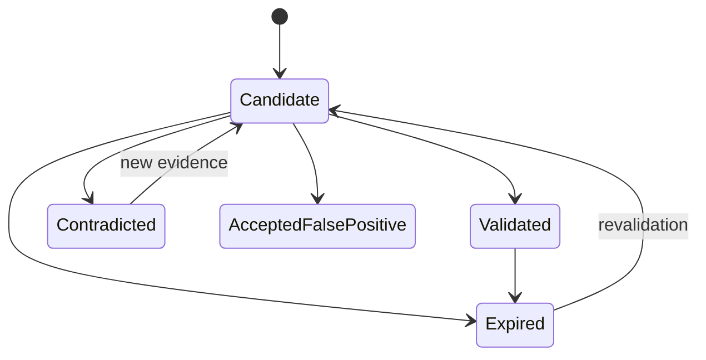
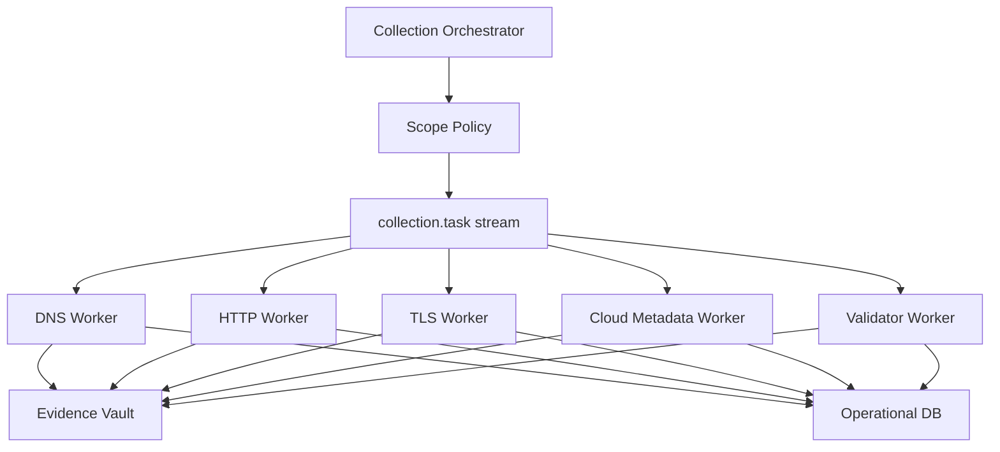

# Lattice9

## Offensive Intelligence Operating System

**Document class:** controlled technical memorandum  
**Audience:** professional red teams, adversary simulation units, infrastructure security researchers, graph systems engineers, and operators responsible for authorized offensive analysis  
**Primary capability:** stateful infrastructure relationship analysis and temporal attack-path inference  
**Operational posture:** evidence-centric, graph-native, deterministic where claims affect execution or prioritization

Lattice9 is not a pentest dashboard, scanner wrapper, recon automation toy, or AI assistant. It is a stateful offensive-intelligence framework for modeling infrastructure as an evolving graph of assets, identities, services, exposures, evidence, privileges, trust relationships, and attack-path hypotheses.

The platform is built around a narrow doctrine:

```text
Observations are not findings.
Findings are not intelligence.
Intelligence is the compression of evidence, relationships, time, and operational consequence.
```

## Table of Contents

1. [Abstract](#01-abstract)
2. [Research Motivation](#02-research-motivation)
3. [Problem Statement](#03-problem-statement)
4. [Industry Failure Analysis](#04-industry-failure-analysis)
5. [Why Existing Pentest Platforms Fail](#05-why-existing-pentest-platforms-fail)
6. [Scanner Orchestration vs Offensive Intelligence](#06-scanner-orchestration-vs-offensive-intelligence)
7. [Core Design Philosophy](#07-core-design-philosophy)
8. [System Architecture](#08-system-architecture)
9. [Graph Intelligence Layer](#09-graph-intelligence-layer)
10. [Temporal Reasoning Engine](#10-temporal-reasoning-engine)
11. [Infrastructure Relationship Modeling](#11-infrastructure-relationship-modeling)
12. [Attack Path Generation](#12-attack-path-generation)
13. [Exploitability Scoring](#13-exploitability-scoring)
14. [Confidence Propagation](#14-confidence-propagation)
15. [Probabilistic Prioritization](#15-probabilistic-prioritization)
16. [Evidence Lineage System](#16-evidence-lineage-system)
17. [Drift Detection Engine](#17-drift-detection-engine)
18. [Exposure Propagation Theory](#18-exposure-propagation-theory)
19. [Stateful Analysis Model](#19-stateful-analysis-model)
20. [Graph Database Architecture](#20-graph-database-architecture)
21. [Correlation Engine](#21-correlation-engine)
22. [Entity Resolution Pipeline](#22-entity-resolution-pipeline)
23. [Threat Modeling](#23-threat-modeling)
24. [False Positive Suppression](#24-false-positive-suppression)
25. [Operational Workflows](#25-operational-workflows)
26. [Analyst Interaction Model](#26-analyst-interaction-model)
27. [Validation Engine](#27-validation-engine)
28. [Reproducibility Guarantees](#28-reproducibility-guarantees)
29. [Distributed Collection Architecture](#29-distributed-collection-architecture)
30. [Queue And Event Systems](#30-queue-and-event-systems)
31. [Memory Architecture](#31-memory-architecture)
32. [Security Hardening](#32-security-hardening)
33. [Adversarial Abuse Considerations](#33-adversarial-abuse-considerations)
34. [Ethical Constraints](#34-ethical-constraints)
35. [Scalability Considerations](#35-scalability-considerations)
36. [Mathematical Models](#36-mathematical-models)
37. [Graph Theory Foundations](#37-graph-theory-foundations)
38. [Bayesian Confidence Systems](#38-bayesian-confidence-systems)
39. [Temporal Delta Computation](#39-temporal-delta-computation)
40. [Attack Chain Synthesis](#40-attack-chain-synthesis)
41. [Infrastructure Topology Analysis](#41-infrastructure-topology-analysis)
42. [Privilege Escalation Modeling](#42-privilege-escalation-modeling)
43. [Exposure Inheritance](#43-exposure-inheritance)
44. [Lateral Movement Analysis](#44-lateral-movement-analysis)
45. [Performance Engineering](#45-performance-engineering)
46. [Future Research Directions](#46-future-research-directions)
47. [Red-Team Applications](#47-red-team-applications)
48. [Enterprise Applications](#48-enterprise-applications)
49. [Limitations](#49-limitations)
50. [Closing Doctrine](#50-closing-doctrine)


---

## 01. Abstract

Lattice9 is an Offensive Intelligence Operating System for authorized infrastructure analysis, attack-surface reasoning, and attack-path inference. It treats modern infrastructure as a temporally evolving directed multigraph rather than a collection of scanner outputs. Nodes represent assets, identities, services, vulnerabilities, trust zones, credentials, observations, and objectives. Edges encode reachability, containment, ownership, authentication, dependency, privilege inheritance, exposure propagation, evidence support, and temporal transitions.

The system is designed to answer questions that ordinary vulnerability management systems cannot express:

- Which relationships make an otherwise moderate exposure operationally decisive?
- Which infrastructure changes increased attack feasibility since the last observation window?
- Which findings are unsupported noise, and which are convergent evidence?
- Which graph paths connect external exposure to privileged control planes?
- Which assumptions must be validated before an attack chain is considered credible?

Lattice9 prioritizes reasoning over summarization. It does not convert scanner output directly into truth. Every claim is represented as a hypothesis with evidence, provenance, confidence, temporal context, contradiction handling, and replay metadata.

---

## 02. Research Motivation

Offensive security work has become data-saturated and reasoning-starved. External attack-surface programs produce large volumes of domains, URLs, ports, banners, screenshots, JavaScript bundles, certificates, cloud metadata, package versions, and scanner signatures. The failure mode is not lack of telemetry. The failure mode is the absence of an intelligence substrate capable of preserving relationships across time.

Modern infrastructure behaves more like a dynamic physical system than a static inventory. Services appear and disappear. Identity boundaries shift. CDNs obscure ownership. Cloud resources inherit privileges through control-plane relationships. A single certificate reuse event may imply deployment lineage. A single exposed management endpoint may inherit risk through identity federation. A single low-severity flaw may become high-impact when positioned on a high-centrality service.

Lattice9 exists to reduce entropy:

$$
H(X) = -\sum_i p(x_i)\log_2 p(x_i)
$$

In this context, entropy is the uncertainty an operator faces when moving from raw observations to operational decisions. The platform's purpose is not to maximize data volume. Its purpose is to reduce uncertainty while preserving evidence.

---

## 03. Problem Statement

Given an authorized target environment \(E_t\) at time \(t\), construct a stateful offensive intelligence model:

$$
G_t = (V_t, E_t, W_t, C_t, T_t)
$$

Where:

- \(V_t\) is the set of entities at time \(t\).
- \(E_t\) is the set of directed typed relationships.
- \(W_t\) is the relationship weight matrix.
- \(C_t\) is the confidence distribution over nodes, edges, and claims.
- \(T_t\) is the temporal validity interval for each element.

The system must infer, rank, explain, validate, and preserve attack-chain hypotheses:

$$
P = \langle v_0, e_1, v_1, e_2, ..., e_k, v_k \rangle
$$

Such that:

- \(v_0\) is an entry surface or initial condition.
- \(v_k\) is an objective, impact node, privilege target, or analyst-defined goal.
- Each transition \(e_i\) is supported by evidence or a deterministic inference rule.
- Each path contains explicit preconditions, confidence, feasibility, and rejection criteria.

---

## 04. Industry Failure Analysis

The security industry has over-indexed on collection and under-invested in reasoning. The standard product pattern is:

```text
run tools -> ingest output -> normalize severity -> render dashboard -> call it intelligence
```

That pattern collapses under operational pressure. It fails because attack feasibility is relational, not list-based.

| Industry Pattern | Failure Mode | Lattice9 Position |
| --- | --- | --- |
| Scanner aggregation | More findings, not better decisions | Findings must be evidence-backed hypotheses |
| Static severity scoring | Ignores topology and privilege context | Risk is graph-position dependent |
| Flat asset inventory | Cannot represent trust or inheritance | Infrastructure is a directed multigraph |
| One-time scan reports | No temporal memory | Every state is diffed against history |
| AI-generated summaries | Fabricates certainty | LLM output is advisory, never authoritative |
| Decorative graph UI | Visual complexity without reasoning | Graphs are computation substrates |
| Ticket export workflows | Breaks evidence lineage | Claims retain provenance through reporting |

---

## 05. Why Existing Pentest Platforms Fail

Existing platforms generally fail at five technical boundaries.

### 5.1 Statelessness

Scans are treated as isolated events. This destroys the ability to detect behavioral drift, exploitability changes, exposure emergence, and regression.

### 5.2 Weak Entity Ownership

Tools observe strings: hostnames, IPs, ports, headers, screenshots. Intelligence requires durable entities and reversible merges. A DNS name, an IP, and a service banner may be separate observations of one operational object or weak signals of unrelated infrastructure.

### 5.3 Lack Of Relationship Semantics

Most systems store:

```text
host has port
port has finding
finding has severity
```

Lattice9 stores:

```text
identity authenticates to service
service depends on upstream API
host inherits subnet exposure
finding grants privilege under precondition
credential may traverse trust boundary
objective is reachable through validated sequence
```

### 5.4 Absence Of Reproducibility

If a platform cannot reconstruct why it believed a claim at a specific time, it is not an intelligence system. It is a transient UI over tool output.

### 5.5 Misuse Of AI

LLMs are useful for explanation, compression, and analyst assistance. They are not evidence engines. Lattice9 does not allow an LLM to create authoritative findings, alter validation state, schedule active probes, or invent exploitability.

---

## 06. Scanner Orchestration vs Offensive Intelligence

Scanner orchestration answers:

```text
What tools ran?
What did they print?
What severity labels appeared?
```

Offensive intelligence answers:

```text
What changed?
What converged?
What relationships matter?
What path is feasible?
What evidence supports the path?
What assumptions can invalidate it?
```

The distinction is structural:

| Property | Scanner Orchestration | Offensive Intelligence |
| --- | --- | --- |
| Unit of work | Tool execution | Evidence-backed state transition |
| Data model | Lists and results | Temporal graph |
| Memory | Run history | Entity and relationship evolution |
| Prioritization | Severity and count | Feasibility, centrality, exposure, confidence |
| Evidence | Attached text | Immutable lineage |
| Analyst role | Triage outputs | Validate hypotheses and direct inquiry |
| Failure handling | Retry tools | Preserve contradictions and uncertainty |

---

## 07. Core Design Philosophy

Lattice9 follows six engineering doctrines.

### 7.1 Evidence Before Claim

No finding, relationship, or attack path is authoritative unless it links to evidence.

### 7.2 Graphs Are Computational, Not Decorative

The graph is used for traversal, inference, propagation, centrality, segmentation, and path synthesis. Visualization is secondary.

### 7.3 Temporal State Is First-Class

Every entity, edge, finding, and claim has a history. Current state is only a view over an append-only evidence record.

### 7.4 Confidence Is Propagated, Not Announced

Confidence is computed from evidence source reliability, independence, freshness, contradiction, and graph context.

### 7.5 Determinism At Decision Boundaries

LLMs may assist interpretation. Critical state transitions require deterministic rules, validators, or analyst decisions.

### 7.6 Operational Density Over Presentation

The system optimizes for analyst decision loops, not aesthetic dashboards.

---

## 08. System Architecture



### Layer Responsibilities

| Layer | Responsibility | Non-Responsibility |
| --- | --- | --- |
| Collection | Execute authorized probes and passive gathers | Declare exploitability |
| Normalization | Convert raw artifacts into typed observations | Merge entities |
| Correlation | Resolve entities and infer relationships | Execute tools |
| Reasoning | Synthesize ranked attack paths | Parse raw output |
| Validation | Confirm or contradict hypotheses | Invent targets |
| Memory | Preserve temporal state and drift | Replace evidence |
| Evidence | Chain-of-custody and replay metadata | Score risk |

---

## 09. Graph Intelligence Layer

### Module Architecture

The graph intelligence engine (`server-py/`) is organized as a modular Python package:

```text
server-py/
├── main.py                 # FastAPI entry point + pipeline orchestration
├── config.py               # Environment configuration
├── models.py               # Pydantic data models
├── db.py                   # PostgreSQL async connection pool
├── graph/
│   ├── schema.py           # Multi-label Neo4j schema (typed nodes, edges, constraints)
│   ├── engine.py           # Core node/edge CRUD operations
│   ├── algorithms.py       # Dijkstra, BFS/DFS, PageRank, centrality, blast radius
│   ├── temporal.py         # Snapshots, diffs, drift detection
│   └── confidence.py       # Bayesian confidence propagation
├── reasoning/
│   ├── attack_paths.py     # Weighted multi-path inference + composite scoring
│   ├── exploit_chains.py   # Exploit dependency mapping + feasibility scoring
│   └── prioritization.py   # Contextual priority ranking (entropy-weighted)
└── evidence/
    └── lineage.py          # Immutable evidence chains + provenance graphs
```

### API Endpoints

| Endpoint | Function |
| --- | --- |
| `POST /analyze/{engagement_id}` | Runs full intelligence pipeline analysis (Neo4j mergers, BBP confidence propagation, Dijkstra routing, Postgres prioritization) |
| `POST /events/{engagement_id}` | Triggers event-driven re-analysis for specific graph operations (e.g. `evidence_added`, `finding_updated` confidence recalculations) |
| `GET /snapshots/{engagement_id}` | Retrieves historical timeline of captured point-in-time graph snapshots |
| `GET /snapshots/{engagement_id}/drift` | Computes topological graph drift and structural mutations between two snapshots |
| `GET /snapshots/{engagement_id}/replay/{path_id}` | Performs a step-by-step playback simulation of an attack path with dynamic precondition evaluation |
| `GET /algorithms/{engagement_id}` | Runs and returns graph algorithm metrics (Centrality, Influence Propagation, Blast Radius, Privilege Chains, Exposure Diffusion) |
| `GET /algorithms/{engagement_id}/paths` | Computes economics-aware Dijkstra shortest attack pathways to target assets |
| `GET /algorithms/{engagement_id}/exploit-chains` | Synthesizes exploit blueprints matching the target environment constraints |
| `GET /evidence/{engagement_id}/lineage` | Compiles full evidence provenance graph showing how all evidence items connect to findings |
| `GET /evidence/{evidence_id}/provenance` | Retrieves recursive provenance chain tracing evidence back to tool outputs and target findings |
| `GET /evidence/{finding_id}/pedigree` | Computes derived pedigree genealogy, recursively tracing ancestral supporting/contradicting evidence networks |
| `GET /evolution/{engagement_id}` | Computes infrastructure temporal metrics including surface entropy, trust drift, credential spread, and topology instability |
| `POST /counterfactual/{engagement_id}/credential-compromise` | What-if scenario: simulate lateral compromise cascade propagation from a compromised credential |
| `POST /counterfactual/{engagement_id}/edge-removal` | What-if scenario: simulate removal of a relationship edge (trust, authentication, network) |
| `POST /counterfactual/{engagement_id}/defense-addition` | What-if scenario: simulate adding a defense control (MFA, segment, patching) and compute mitigation effectiveness |
| `POST /counterfactual/{engagement_id}/comprehensive` | Performs a full comprehensive counterfactual defense sweep across all potential mitigations |
| `GET /entropy/{engagement_id}` | Computes Attack Path Entropy Collapse (path entropy, privilege inevitability, graph ambiguity, collapse recommendations) |
| `POST /causal/{engagement_id}/path-analysis` | Performs structural causal inference and Pearlian interventions on an attack path |
| `GET /causal/{engagement_id}/root-cause` | Conducts cross-path causal root-cause analysis to pinpoint critical choke-points |
| `POST /causal/{engagement_id}/what-if` | Simulates localized interventions (remove, harden, isolate) on specific nodes |
| `GET /blast/{engagement_id}/{node_id}` | Computes topological blast radius v2 (exploitability, reach, downstream dependencies) |
| `GET /blast/{engagement_id}/all` | Ranks all environment nodes by total blast radius risk |
| `GET /blast/{engagement_id}/credential-cascade` | Analyzes cascading network credential exposure risks |
| `GET /health` | Checks status of engine components (FastAPI, Neo4j, Redis, PostgreSQL) |

Lattice9 models infrastructure as a directed, typed, weighted multigraph:

$$
G = (V, E, \tau, w, c)
$$

Where:

- \(V\) is a heterogeneous entity set.
- \(E \subseteq V \times R \times V\) is a typed relationship set.
- \(\tau(e)\) is the relationship type.
- \(w(e)\) is traversal cost or influence weight.
- \(c(e)\) is confidence.

### Node Classes

| Node | Description |
| --- | --- |
| Asset | Abstract infrastructure object |
| Host | Hostname, instance, IP-backed service host |
| Service | Protocol endpoint with version and exposure state |
| Endpoint | HTTP route, API method, management surface |
| Identity | User, group, service account, role |
| Credential | Credential material or credential metadata |
| Vulnerability | Abstract weakness or CVE |
| Finding | Environment-specific manifestation of weakness |
| Evidence | Artifact-backed support for a claim |
| TrustZone | Inferred administrative or network boundary |
| Objective | Analyst-defined target state |

### Edge Classes

```text
RESOLVES_TO        Domain -> IPAddress
HOSTS             Host -> Service
EXPOSES           Service -> Endpoint
AUTHENTICATES_TO  Identity -> Service
TRUSTS            TrustZone -> TrustZone
DEPENDS_ON        Service -> Service
HAS_FINDING       Service -> Finding
GRANTS_PRIVILEGE  Finding -> Identity
CAN_REACH         Entity -> Service
EVIDENCED_BY      Claim -> Evidence
CHANGED_TO        PriorState -> CurrentState
```

Graph databases are required because attack reasoning is traversal-heavy. A relational-only model can store edges, but multi-hop queries across heterogeneous relationship types become expensive, opaque, and operationally awkward. The core query is not "list findings by asset." The core query is:

```text
Find bounded-cost paths from exposed entry nodes to privileged objectives,
where every transition is supported by evidence and confidence exceeds threshold.
```

---

## 10. Temporal Reasoning Engine

Lattice9 treats time as a graph dimension. Each node and edge has:

```text
first_seen_at
last_seen_at
valid_from
valid_to
observation_window
confidence_decay_profile
```

The temporal graph sequence is:

$$
\mathcal{G} = \{G_{t_0}, G_{t_1}, ..., G_{t_n}\}
$$

Temporal reasoning computes deltas:

$$
\Delta G_{a,b} = (V_b \setminus V_a,\ E_b \setminus E_a,\ W_b - W_a,\ C_b - C_a)
$$

An exposure that appears at time \(t_b\) and connects to existing privilege-bearing relationships receives a drift multiplier:

$$
D(v) = \alpha \cdot \Delta exposure(v) + \beta \cdot \Delta centrality(v) + \gamma \cdot \Delta privilege(v)
$$

This is analogous to pressure changes in a physical system. The existence of a new opening is not meaningful by itself; it matters when it changes flow through the system.

---

## 11. Infrastructure Relationship Modeling

Infrastructure relationships are typed hypotheses with supporting evidence, not labels on a diagram.

### Relationship Tree

```text
Organization
  |-- OWNS --> Domain
  |             |-- RESOLVES_TO --> IPAddress
  |                                  |-- IN_SUBNET --> Subnet
  |                                  |-- IN_ASN -----> ASN
  |
  |-- CONTROLS --> CloudAccount
                  |-- HOSTS --> Host
                                |-- EXPOSES --> Service
                                                |-- EXPOSES --> Endpoint
                                                |-- HAS_FINDING --> Finding
```

### Relationship Scoring

Each relationship carries a confidence:

$$
c(e) = r_s \cdot s_e \cdot f_t \cdot k
$$

Where:

- \(r_s\) is source reliability.
- \(s_e\) is evidence strength.
- \(f_t\) is temporal freshness.
- \(k\) is consistency with neighboring graph structure.

Contradictory evidence does not erase the relationship. It lowers confidence and is retained in the lineage model.

---

## 12. Attack Path Generation

An attack path is a bounded sequence of state transitions:

$$
P = \langle n_0, r_1, n_1, ..., r_k, n_k \rangle
$$

Where:

- \(n_0\) is an entry node.
- \(n_k\) is an objective.
- \(r_i\) is a typed transition with evidence and preconditions.

### Attack Path Diagram

```text
[Internet]
    |
    v
[Service: public API]
    |
    | HAS_FINDING: auth bypass candidate
    v
[Finding: weak access control]
    |
    | GRANTS_PRIVILEGE if validated
    v
[Identity: low-priv app user]
    |
    | AUTHENTICATES_TO
    v
[Service: admin API]
    |
    | DEPENDS_ON
    v
[Objective: customer data plane]
```

### Weighted Path Cost & Constraint-Aware Dijkstra

For a path $P$, Lattice9 performs pathfinding using a custom **Constraint-Aware Weighted Dijkstra Shortest Path Engine**. Instead of simple static relationship evaluations, traversal weights dynamically compute transition probabilities on the fly during variable-length queue expansion.

For an edge $e = (u, v)$, the traversal cost is calculated as the negative log-likelihood of successful attack transition combined with the economic cost and detection risk associated with the specific operational step:

$$
Cost(u, v) = -\ln(P(u \to v)) + \text{EconomicCost}(u \to v) + \text{DetectionRisk}(u \to v)
$$

Where the transition probability $P(u \to v)$ is dynamically constrained by environmental conditions:

$$
P(u \to v) = \frac{P(\text{node state}) \times \text{relationship\_weight} \times \text{exploit\_feasibility}}{\text{relationship\_penalty}}
$$

#### Exploit Precondition Auditing

During the Dijkstra priority-queue expansion, the engine evaluates step-by-step target preconditions:

1. **Target Operating System Platform**: Evaluates the target host platform compatibility (e.g., executing a Windows-only EternalBlue exploit against a Linux OS targets probability to $0.05$, or $0.01$ dynamic floor).
2. **Exposure Ingress Port Exposure**: Validates that target service ports are actively exposed and listening (mismatched ports penalize probability to $0.10$, or $0.01$ dynamic floor).
3. **Active Authentication & Credentials**: Checks the availability of authenticating credentials. If missing, probability is penalized to $0.15$.
4. **Outbound Egress & Reachability**: Verifies host reachability to prevent routing through air-gapped zones.

Mismatched preconditions generate massive cumulative costs (e.g., $+3.0$ to $+4.6$), forcing Dijkstra to route cleanly around unrealistic vectors in real-time, preferring an operationally sound path.

#### Attacker ROI Traversal Optimization

Path prioritization uses a game-theoretic Attacker Return-on-Investment (ROI) metric representing the efficiency of the traversal path to the objective:

$$
\text{ROI} = \frac{\text{ExposureGain}}{\text{TotalEconomicCost} \times (1.0 + \text{TotalDetectionRisk})}
$$

Where:

- $\text{ExposureGain}$ represents the cumulative blast radius exposure score of the objective asset.
- $\text{TotalEconomicCost}$ is the accumulated operational complexity / cost of exploit execution across the path sequence (e.g., $+0.5$ per finding exploit, $+0.1$ per service traversal).
- $\text{TotalDetectionRisk}$ is the accumulated visibility signature of the attacker on sensors / EDR (e.g., $+0.4$ EDR alert visibility for exploits, $+0.05$ for quiet traversal).

This economic weighting steers the graph reasoning system to prioritize pathways that minimize analyst cognitive overhead while maximizing simulated exploit fidelity.

---

## 13. Exploitability Scoring

Exploitability is an environmental function, not a scanner severity.

$$
X_f = M_f \cdot E_f \cdot R_f \cdot P_f \cdot C_f \cdot T_f
$$

Where:

- \(M_f\) is exploit maturity.
- \(E_f\) is exposure reachability.
- \(R_f\) is required privilege inverse.
- \(P_f\) is precondition satisfaction.
- \(C_f\) is evidence confidence.
- \(T_f\) is temporal freshness.

### Exploitability State

| State | Meaning |
| --- | --- |
| candidate | Evidence suggests a weakness may exist |
| contextual | Weakness exists but impact depends on environment |
| validated | Deterministic validation supports exploitability |
| contradicted | Evidence conflicts with the hypothesis |
| expired | Evidence is too old for path promotion |
| accepted_false_positive | Analyst decision suppresses the claim |

---

## 14. Confidence Propagation

Confidence propagates through modern infrastructure topologies (which contain cycle loop cliques and contradictory priors) using a multi-round **Bayesian Belief Propagation (BBP)** loop. Every direct evidence update acts as a local prior, propagates laterally through trust, exploit, or containment edges, and updates adjacent beliefs.

### Multi-Round Loopy Belief Propagation & Cyclic Damping

In cyclic topologies, standard belief updates generate infinite feedback runaway. Lattice9 stabilizes sweeps by applying a static damping factor ($\alpha = 0.75$) to subsequent belief iterations:

$$
\text{Bel}_{t+1}(X) = \alpha \cdot \text{Bel}_{\text{new}}(X) + (1 - \alpha) \cdot \text{Bel}_t(X)
$$

### Dynamic Oscillation Shield

If BBP sweeps detect fluctuating or increasing delta changes across iterations (indicating cyclic loopy oscillation), the **Dynamic Oscillation Shield** is automatically activated, decaying $\alpha$ by a factor of $0.70$ per step:

$$
\alpha \leftarrow \alpha \cdot 0.70
$$

This guarantees mathematical convergence and shields the reasoning engine from loopy confidence blowout under dense cyclic loops.

For large environments exceeding a scale boundary (500 nodes), running full BBP sweeps across disconnected assets causes database bottlenecks. The engine dynamically partitions the graph, structurally restricting the BBP propagation to a **4-hop neighborhood boundary** centered around active Findings, Credentials, or Vulnerabilities. This shields PG and Neo4j from disconnected noise.

### Temporal Confidence Decay

Over time, the confidence in a finding or compromise state decays if it is not actively re-observed. Lattice9 models this temporal discount using an exponential decay function:

$$
P(H)_t = P(H)_0 \cdot e^{-\lambda \cdot t}
$$

Where:

- $P(H)_0$ is the base prior confidence computed from severity (e.g., Critical = 0.90, High = 0.70).
- $t$ is the elapsed duration in days since the finding was last observed.
- $\lambda$ is the decay constant derived from a configured **30-day half-life**:

$$
\lambda = \frac{\ln(2)}{30} \approx 0.0231
$$

This temporal discount ensures that ancient, unvalidated vulnerability claims gracefully fade out of the active attack path priority queues.

### Bayesian Fusion & Log-Odds

For independent evidence:

$$
P(H \mid E_1, ..., E_n) = 1 - \prod_{i=1}^{n}(1 - P(H \mid E_i))
$$

The engine uses log-odds internally to prevent floating-point underflow and clamp confidence boundaries safely within $[0.01, 0.999]$:

$$
logit(p) = \ln\left(\frac{p}{1-p}\right)
$$

$$
p = \frac{1}{1 + e^{-x}}
$$

---

## 15. Probabilistic Prioritization

Priority is not severity. Priority is the expected operational value of analyst attention.

$$
Priority(P) = Impact(P) \cdot Feasibility(P) \cdot Confidence(P) \cdot Drift(P) \cdot Centrality(P)
$$

### Prioritization Table

| Factor | Question |
| --- | --- |
| Impact | What objective becomes reachable? |
| Feasibility | Are preconditions satisfied? |
| Confidence | Is evidence convergent and fresh? |
| Drift | Did the environment become more exposed? |
| Centrality | Does the path traverse a trust hub? |
| Validation | Which steps are proven versus inferred? |

In thermodynamic terms, priority measures the gradient between current access and objective state. The highest-value paths are those where small validated transitions produce large changes in reachable privilege or data exposure.

---

## 16. Evidence Lineage System

Every claim must be traceable:

```text
attack_path_step
  -> finding or relationship
  -> normalized observation
  -> evidence item
  -> raw artifact
  -> tool execution
  -> collection run
  -> scope version
  -> authorization record
```

### Evidence Classes

| Class | Description | Authority |
| --- | --- | --- |
| raw | HTTP exchange, scanner output, screenshot, DNS result | High if captured correctly |
| parsed | Field extracted by parser | Depends on parser |
| inferred | Relationship produced by rule | Depends on evidence and rule |
| validated | Deterministic validator output | High |
| advisory | LLM or analyst summary | Non-authoritative |

### Integrity

Artifacts are content-addressed:

$$
artifact\_id = SHA256(bytes)
$$

Evidence is append-only. Corrections are represented by new evidence or contradiction records.

### Evidence Provenance & Pedigree Recursion

To prevent "topology cosplay" where findings are visually claimed but unproven, Lattice9 includes an **Evidence Provenance Pedigree Recursion** model. The engine recursively traverses the direct and ancestral lineage back to raw, content-addressed tool outputs (`SHA256` fingerprints):

1. **Pedigree Genealogy Graph Tracing**: Recursively builds an immutable pedigree genealogy tracking the ancestral tree of supporting and contradicting evidence signals ($fe.role \in \{ \text{'supporting'}, \text{'contradicting'} \}$).
1. **Confidence Delta Propagation**: Propagates the structural confidence delta ($\Delta c$) of all associated evidence ancestors:

$$
\text{NetConfidence}(F) = \sum_{E_i \in \text{Supporting}} \Delta c(E_i) - \sum_{E_j \in \text{Contradicting}} \Delta c(E_j)
$$

1. **Depth-Bounded Compilation**: Anchors belief updates with an ancestry depth limit ($D \le 5$) to prevent infinite cycles in complex multi-source correlation.

This allows security analysts to perform instantaneous click-to-pedigree verification of any composite finding in the operating system.

---

## 17. Drift Detection Engine

Drift is the observable change in attack surface state between snapshots.

Lattice9 quantifies topological drift as a multi-dimensional drift score representing the weighted sum of node, relationship, and confidence variations between two captured snapshots $G_a$ and $G_b$:

$$
\text{DriftScore}(G_a, G_b) = \min\left(1.0, \sum_i w_i \cdot \Delta_i\right)
$$

Where the individual mutation factors and weights are defined as:

$$
\sum_i w_i \cdot \Delta_i = 0.3 \cdot N_{\text{added}} + 0.2 \cdot N_{\text{removed}} + 0.2 \cdot N_{\text{modified}} + 0.4 \cdot E_{\text{added}} + 0.2 \cdot E_{\text{removed}} + 0.2 \cdot E_{\text{modified}}
$$

And:
- $N_{\text{added}}, N_{\text{removed}}, N_{\text{modified}}$ represent the counts of entities added, removed, or experiencing confidence shifts (>0.05).
- $E_{\text{added}}, E_{\text{removed}}, E_{\text{modified}}$ represent the counts of relationship edges added, removed, or experiencing weight changes (>0.05).

#### Structural Mutation Types

The drift mutation engine classifies topological shifts into the following operational mutation categories:

1. **Trust Mutations (`trust_mutation`)**: Triggered when new trust relationships (`TRUSTS` edges) appear in the graph, representing potential lateral movement extensions (Drift weight = 0.5).
1. **Credential Spreading (`credential_spread`)**: Triggered when a credential newly authenticates to a target service/host (`AUTHENTICATES_TO` edge), widening compromised surfaces (Drift weight = 0.4).
1. **Blast Radius Expansion (`blast_radius_expansion`)**: Triggered when a new privilege escalation transition (`PRIVILEGE_ESCALATION` edge) appears, expanding downstream exposure (Drift weight = 0.6).
1. **Confidence Shifts (`confidence_shift`)**: Triggered by significant belief delta changes, representing newly derived evidence or contradictory signals.
1. **New Findings (`new_finding`)**: Triggered when a new vulnerability or exposure finding node is merged.


### Drift Types

| Drift | Example | Operational Effect |
| --- | --- | --- |
| Exposure drift | New service becomes internet reachable | New entry nodes |
| Trust drift | New dependency edge appears | New lateral movement path |
| Identity drift | New service account observed | New privilege graph node |
| Exploitability drift | Validator confirms candidate | Path feasibility increases |
| Ownership drift | Asset correlation changes | Scope and attribution re-evaluation |
| Behavioral drift | Endpoint response class changes | Anomaly queue |

---

## 18. Exposure Propagation Theory

Exposure behaves like diffusion across a constrained topology. A service exposed to the internet can transfer exposure pressure to downstream services if dependencies, credentials, or trust relationships connect them.

Let \(x_t\) be the exposure vector over nodes at time \(t\). Let \(A\) be the weighted adjacency matrix and \(D\) a damping matrix for controls and segmentation.

$$
x_{t+1} = \sigma(Ax_t - Dx_t + b_t)
$$

Where:

- \(b_t\) is external exposure input.
- \(D\) represents friction such as segmentation, authentication, and controls.
- \(\sigma\) bounds exposure to \([0,1]\).

This resembles signal propagation through a lossy medium. Authentication, segmentation, and validation uncertainty act as attenuation. Trust relationships and credential reuse act as gain.

---

## 19. Stateful Analysis Model

Lattice9 stores state as bitemporal facts:

```text
observed_at      when evidence was captured
valid_from       when fact is believed to begin
valid_to         when fact is superseded or invalidated
recorded_at      when Lattice9 recorded it
```

This permits replay:

```text
What did the engine believe on 2026-05-15?
Which evidence supported that belief?
Which later evidence contradicted it?
Which attack paths were promoted because of it?
```

State is not overwritten. It is refined.

---

## 20. Graph Database Architecture

Lattice9 uses relational storage for authoritative operational records and graph storage for traversal workloads.



### Why Relational-Only Fails

Relational databases can store edges, but attack reasoning requires repeated variable-length traversals across typed relationships:

```cypher
MATCH p = (entry)-[:CAN_REACH|HAS_FINDING|GRANTS_PRIVILEGE|AUTHENTICATES_TO*1..6]->(objective)
WHERE all(r IN relationships(p) WHERE r.confidence > 0.65)
RETURN p
ORDER BY reduce(cost = 0, r IN relationships(p) | cost + r.cost)
LIMIT 20
```

This is the native domain of graph databases.

---

## 21. Correlation Engine

The correlation engine turns observations into durable entities and typed relationships.

### Pipeline

```text
raw artifact
  -> parser output
  -> canonical observation
  -> candidate entity
  -> entity resolution
  -> relationship inference
  -> graph projection
  -> reasoning task
```

### Correlation Score

$$
score(a,b) = \sum_i \omega_i sim_i(a,b) - \sum_j \eta_j conflict_j(a,b)
$$

Features include:

- FQDN equality.
- IP equality or subnet proximity.
- TLS certificate reuse.
- Cloud account identifier.
- Header and banner similarity.
- Favicon hash.
- Nameserver affinity.
- ASN ownership.
- Temporal co-occurrence.

Merges are reversible. Analyst overrides become first-class audit records.

---

## 22. Entity Resolution Pipeline

Entity resolution is conservative by design. False merges damage graph reasoning more severely than duplicates.

### Deterministic Resolution

Exact identifiers:

```text
ip:203.0.113.10
fqdn:api.example.test
cert_sha256:...
aws_account:...
azure_tenant:...
cve:CVE-YYYY-NNNN
```

### Probabilistic Resolution

Weak signals:

```text
same title + same CDN + same certificate issuer + same deployment window
```

### Resolution Pseudocode

```python
def resolve_entity(observation, candidates):
    exact = exact_key_match(observation, candidates)
    if exact:
        return exact, 1.0, "deterministic_key"

    ranked = []
    for candidate in candidates:
        s = weighted_similarity(observation.features, candidate.features)
        p = contradiction_penalty(observation, candidate)
        ranked.append((candidate, s - p))

    candidate, score = max(ranked, key=lambda item: item[1])
    if score >= MERGE_THRESHOLD:
        return candidate, score, "probabilistic_merge"

    return create_new_entity(observation), 0.75, "new_entity"
```

---

## 23. Threat Modeling

Lattice9 is itself sensitive infrastructure. It stores offensive knowledge, target scope, evidence, credentials, inferred attack paths, and analyst decisions.

### Threat Matrix

| Threat | Impact | Control |
| --- | --- | --- |
| Unauthorized scan execution | Legal harm and operational escalation | Scope gates, approvals, rate controls |
| Evidence exfiltration | Client data exposure | Encryption, RBAC, signed access URLs |
| Graph poisoning | Bad prioritization and hidden risk | Evidence requirements, source weighting |
| Cross-tenant leakage | Critical confidentiality breach | Row-level security, tenant graph isolation |
| Prompt injection | Misleading advisory output | LLM cannot mutate facts |
| Validator abuse | Active probing misuse | Policy engine and sandboxed execution |
| Insider suppression | Real risk hidden | Audit trail and peer review |

---

## 24. False Positive Suppression

False positive suppression is a reasoning system, not a checkbox.

### Suppression Model

$$
Signal(f) = Evidence(f) \cdot Relevance(f) \cdot Freshness(f) \cdot Independence(f) - Contradiction(f)
$$

Findings below threshold remain visible as low-confidence candidates but are not promoted into attack paths.

### Suppression Inputs

| Input | Effect |
| --- | --- |
| Duplicate cluster | Reduces repeated scanner noise |
| Unreachable service | Suppresses exploitability |
| Expired evidence | Lowers confidence |
| Contradictory validation | Transitions to contradicted |
| Weak source family | Reduces confidence gain |
| High-centrality affected node | Raises relevance |

---

## 25. Operational Workflows

### 25.1 Engagement Setup

```text
define engagement
  -> record authorization
  -> define include/exclude scope
  -> compile policy
  -> enable collection profiles
```

### 25.2 Collection To Intelligence

```text
collection run
  -> evidence capture
  -> normalization
  -> correlation
  -> graph projection
  -> temporal diff
  -> path synthesis
  -> analyst triage
```

### 25.3 Attack Path Triage

```text
ranked path
  -> inspect reasoning trace
  -> inspect evidence
  -> validate weak steps
  -> accept / reject / annotate
  -> preserve decision
```

### Scenario: External API To Control Plane

An operator observes a public API service with a candidate access-control weakness. Lattice9 does not declare compromise. It constructs a hypothesis:

```text
public API -> weak authorization candidate -> low-priv identity -> admin API trust edge -> data-plane objective
```

The analyst sees which transition is weak, which validator could confirm it, which evidence supports the service dependency, and which prior snapshot lacked the relationship.

---

## 26. Analyst Interaction Model

The analyst is not a button-clicking passenger. The analyst is the control loop.

### Workbench Principles

- Dense tables over large cards.
- Keyboard navigation over animation.
- Evidence panes beside reasoning traces.
- Graph neighborhood views for relationships, not decorative topology.
- Temporal diffs as first-class operational objects.
- Validation requests gated by scope and safety policy.

### Decision Loop



---

## 27. Validation Engine

Validation turns hypotheses into supported or contradicted states.

### Validation Classes

| Class | Description | Default |
| --- | --- | --- |
| passive | Uses existing evidence or passive sources | Allowed |
| non-invasive active | Confirms banners, headers, protocol state | Scope-gated |
| authenticated | Uses provided test credentials | Approval-gated |
| intrusive | Could modify target state or demonstrate impact | Disabled by default |

### State Machine



Validators produce evidence artifacts. They do not produce narrative claims.

---

## 28. Reproducibility Guarantees

Every decision-bearing result stores:

```text
tool name
tool version
container digest
command template hash
input hash
scope version
parser version
worker version
raw artifact hash
evidence IDs
rule IDs
snapshot ID
reasoning trace
```

Replayability matters because offensive work is disputed, audited, and time-sensitive. The system must reconstruct not only what was observed but why it mattered.

---

## 29. Distributed Collection Architecture



Workers are stateless. Durable state is in PostgreSQL, graph projection, and object storage. Queue messages carry identifiers, not large payloads.

---

## 30. Queue And Event Systems

Lattice9 uses event streams for state transitions.

| Stream | Producer | Consumer |
| --- | --- | --- |
| `collection.requested` | API | Orchestrator |
| `collection.task` | Orchestrator | Workers |
| `artifact.created` | Workers | Normalizers |
| `observation.created` | Normalizers | Correlators |
| `relationship.changed` | Correlators | Graph projection |
| `finding.changed` | Correlators/validators | Reasoning engine |
| `snapshot.created` | Memory engine | Drift engine |
| `drift.detected` | Drift engine | Reasoning engine |
| `validation.requested` | Analyst/API | Validation workers |
| `deadletter` | All services | Operations |

### Event Envelope

```json
{
  "message_id": "uuid",
  "tenant_id": "uuid",
  "engagement_id": "uuid",
  "scope_version": 7,
  "idempotency_key": "sha256",
  "trace_id": "uuid",
  "payload_ref": "s3://...",
  "created_at": "timestamp"
}
```

---

## 31. Memory Architecture

Lattice9 separates memory into classes.

| Memory | Storage | Purpose |
| --- | --- | --- |
| Operational | PostgreSQL | Current entities, jobs, findings |
| Graph | Neo4j/ArangoDB | Traversal projection |
| Temporal | PostgreSQL + object storage | Snapshots and diffs |
| Evidence | Object storage + metadata | Raw artifacts and lineage |
| Analyst | PostgreSQL | Notes, overrides, decisions |
| Advisory | PostgreSQL | Non-authoritative summaries |

### Memory Architecture Diagram

```text
                 +-------------------+
                 | Analyst Workbench |
                 +---------+---------+
                           |
          +----------------+----------------+
          |                                 |
  +-------v--------+                +-------v--------+
  | PostgreSQL     |                | Graph Database |
  | facts/history  |<-------------->| projection     |
  +-------+--------+                +----------------+
          |
  +-------v--------+
  | Object Storage |
  | raw evidence   |
  +----------------+
```

---

## 32. Security Hardening

Hardening is not optional. Lattice9 is an offensive knowledge repository.

### Controls

- Row-level security by tenant and engagement.
- Strict scope enforcement before active collection.
- Worker sandboxing and egress policy.
- Evidence encryption and redaction.
- Signed artifact access.
- Vault-backed credentials.
- Immutable audit events.
- Separation between advisory LLM output and authoritative facts.
- No cross-tenant graph traversal.

---

## 33. Adversarial Abuse Considerations

Lattice9 can be misused if operated outside authorized boundaries. The architecture explicitly assumes adversarial abuse risk.

### Abuse Modes

| Abuse | Risk |
| --- | --- |
| Unauthorized targeting | Legal and operational harm |
| Scan amplification | Network abuse and defensive escalation |
| Intelligence misuse | Target profiling outside authorization |
| Autonomous validation abuse | Unsafe active probing |
| Credential mishandling | Unauthorized access |
| Evidence leakage | Exposure of sensitive target data |

The system therefore constrains active behavior, records authorization, separates advisory reasoning from execution, and treats validation as a policy-gated state transition.

---

## 34. Ethical Constraints

Lattice9 is dual-use. Its legitimate use is limited to authorized assessment, red-team operations, adversary emulation, infrastructure security research, and defensive exposure analysis.

The platform must not be used for unauthorized access, coercive targeting, indiscriminate scanning, credential abuse, stealth persistence, destructive actions, or intelligence collection outside legal authority.

The ethical posture is operational, not decorative:

- Authorization is a data object.
- Scope is machine-enforced.
- Active actions are logged.
- Intrusive validators are disabled by default.
- Evidence access is audited.
- Analyst decisions are attributable.

---

## 35. Scalability Considerations

### Storage

- PostgreSQL partitions high-volume observations by engagement and time.
- Object storage handles raw artifacts.
- Graph projection is rebuilt from authoritative facts when schema versions change.

### Graph

Traversal complexity grows with degree and path depth. For branching factor \(b\) and depth \(d\), naive search is:

$$
O(b^d)
$$

Lattice9 controls this through:

- Confidence thresholds.
- Relationship type constraints.
- Objective-directed A* heuristics.
- Cached neighborhoods.
- Precomputed centrality.
- Path depth caps.

### Event Processing

Workers scale horizontally by stream and workload class. Job state is persisted outside the queue.

---

## 36. Mathematical Models

### Attack Path Objective

$$
\arg\min_{P \in Paths(s,o)} Cost(P)
$$

Subject to:

$$
Confidence(P) \geq \theta_c,\quad Scope(P)=true,\quad Evidence(P) \neq \emptyset
$$

### Combined Score

$$
Score(P) = \frac{Impact(P) \cdot Feasibility(P) \cdot Confidence(P)}{1 + Cost(P)}
$$

### Entropy Reduction

Let \(H_0\) be uncertainty before correlation and \(H_1\) after reasoning:

$$
Gain = H_0 - H_1
$$

The platform is useful when it produces positive intelligence gain without erasing uncertainty.

---

## 37. Graph Theory Foundations

### Adjacency Matrix

For nodes:

```text
0 Internet
1 Public API
2 Auth Finding
3 App Identity
4 Admin API
5 Data Plane
```

Weighted adjacency:

$$
A =
\begin{bmatrix}
0 & .9 & 0 & 0 & 0 & 0 \\
0 & 0 & .7 & 0 & 0 & 0 \\
0 & 0 & 0 & .6 & 0 & 0 \\
0 & 0 & 0 & 0 & .8 & 0 \\
0 & 0 & 0 & 0 & 0 & .9 \\
0 & 0 & 0 & 0 & 0 & 0
\end{bmatrix}
$$

### Centrality

Degree centrality:

$$
C_D(v) = \frac{deg(v)}{|V|-1}
$$

Eigenvector centrality:

$$
Ax = \lambda x
$$

PageRank-like influence:

$$
PR(v) = \frac{1-d}{N} + d \sum_{u \in In(v)} \frac{PR(u)}{L(u)}
$$

High-centrality services are not automatically exploitable, but weaknesses on them have higher blast-radius potential.

---

## 38. Bayesian Confidence Systems

Lattice9 models threat progression across structural environments using iterative Bayesian loopy belief propagation. Local findings/evidence act as evidence priors $P(H)$ and propagate laterally over trust, exploit, or containment relations.

### Noisy-OR Lateral Compromise Model

The lateral propagation probability of a target node $X$ given multiple active compromise vectors $E_1, E_2, \dots, E_k$ is modeled as a Noisy-OR system to account for independent pathways of compromise:

$$
P(X \text{ compromised} \mid E_1, \dots, E_k) = 1 - \prod_{i=1}^{k} (1 - P(E_i \text{ propagates}))
$$

### Iterative Damping & Feedback Stabilization

To prevent mathematical feedback blowouts in cyclic graphs, updates are iteratively smoothed using a dynamic damping factor ($\alpha = 0.75$):

$$
\text{Bel}_{t+1}(X) = \alpha \cdot \text{Bel}_{\text{new}}(X) + (1 - \alpha) \cdot \text{Bel}_t(X)
$$

### Mathematical Bounds & Convergence

To prevent division-by-zero, floating-point overflows, or mathematical stagnation during sweeps, beliefs are strictly bounded within a mathematical ceiling and floor:

$$
\text{Bel}(X) \in [0.01, 0.999]
$$

Convergence is reached when the maximum delta change across all nodes drops below $\epsilon = 0.001$ or sweeps reach a maximum of 10 rounds:

$$
\max_{v \in V} |\text{Bel}_{t+1}(v) - \text{Bel}_t(v)| < \epsilon
$$

---

## 39. Temporal Delta Computation

Temporal diffing compares graph states:

$$
N^+ = V_b - V_a
$$

$$
E^+ = E_b - E_a
$$

$$
\Delta w(e) = w_b(e) - w_a(e)
$$

$$
\Delta c(e) = c_b(e) - c_a(e)
$$

### Temporal Diff Pseudocode

```python
def temporal_diff(snapshot_a, snapshot_b):
    added_nodes = snapshot_b.nodes - snapshot_a.nodes
    removed_nodes = snapshot_a.nodes - snapshot_b.nodes
    added_edges = snapshot_b.edges - snapshot_a.edges
    removed_edges = snapshot_a.edges - snapshot_b.edges

    changed_edges = []
    for edge in snapshot_a.edges & snapshot_b.edges:
        dw = snapshot_b.weight(edge) - snapshot_a.weight(edge)
        dc = snapshot_b.confidence(edge) - snapshot_a.confidence(edge)
        if abs(dw) > WEIGHT_EPSILON or abs(dc) > CONFIDENCE_EPSILON:
            changed_edges.append((edge, dw, dc))

    return GraphDelta(added_nodes, removed_nodes, added_edges, removed_edges, changed_edges)
```

---

## 40. Attack Chain Synthesis

Attack-chain synthesis uses bounded weighted traversal over typed relationships.

### Dijkstra-Style Planner

```python
def synthesize_paths(graph, entry_nodes, objective_nodes, max_depth):
    queue = PriorityQueue()
    results = []

    for entry in entry_nodes:
        queue.push(cost=0.0, path=[entry])

    while queue:
        cost, path = queue.pop()
        current = path[-1]

        if current in objective_nodes:
            results.append((cost, path))
            continue

        if len(path) > max_depth:
            continue

        for edge in graph.out_edges(current):
            if not edge.in_scope:
                continue
            if edge.confidence < MIN_EDGE_CONFIDENCE:
                continue
            next_cost = cost + attack_edge_cost(edge)
            queue.push(next_cost, path + [edge.target])

    return rank_paths(results)
```

### Rejection Conditions

Paths are rejected when:

- Evidence is missing.
- Scope is ambiguous.
- Required privilege is unavailable.
- Validation is contradicted.
- Confidence falls below threshold.
- The path depends on expired observations.

---

## 41. Infrastructure Topology Analysis

Topology analysis identifies trust zones, chokepoints, isolated clusters, and high-blast-radius nodes.

### Laplacian

$$
L = D - A
$$

Where \(D\) is the degree matrix and \(A\) is the adjacency matrix.

Spectral partitioning over \(L\) helps detect infrastructure communities:

```text
public edge cluster
identity control cluster
data-plane cluster
developer tooling cluster
third-party dependency cluster
```

### Topology Map

```text
                 +------------------+
                 | Identity Boundary|
                 +---------+--------+
                           |
              TRUSTS / AUTHENTICATES_TO
                           |
+-----------+     +--------v---------+     +-------------+
| Internet  | --> | Public Services  | --> | Internal API |
+-----------+     +--------+---------+     +------+------+
                           |                      |
                           v                      v
                    Findings/Exposure       Data Plane
```

---

## 42. Privilege Escalation Modeling

Privilege escalation is represented as movement through a privilege graph:

$$
G_p = (I, R, P)
$$

Where:

- \(I\) is identities.
- \(R\) is roles or permissions.
- \(P\) is privilege-granting relationships.

### Privilege Transition

$$
priv_{t+1}(i) = priv_t(i) \cup grants(f, context)
$$

A finding does not grant privilege by itself. It grants privilege only under preconditions:

```text
finding validated
affected service reachable
required identity exists
control does not contradict path
scope permits validation
```

---

## 43. Exposure Inheritance

Exposure inheritance models how risk travels through containment and dependency edges.

```text
Internet
  -> public service
      -> host
          -> subnet
              -> trust zone
                  -> dependent service
```

### Inheritance Function

$$
Exposure(child) = Exposure(parent) \cdot c(edge) \cdot (1 - control(child))
$$

Where `control(child)` represents attenuation from authentication, segmentation, rate limiting, or compensating controls.

---

## 44. Lateral Movement Analysis

Lateral movement is graph reachability under privilege constraints.

$$
Reachable(i, s) = \exists P: i \rightarrow ... \rightarrow s
$$

Subject to:

$$
\forall e \in P,\ preconditions(e) = true
$$

### Markov Transition View

The attacker state can be modeled as a Markov chain over access states:

$$
P(X_{t+1}=j \mid X_t=i) = M_{ij}
$$

The transition matrix \(M\) is derived from edge feasibility and confidence. This permits simulation of likely progression under different validation assumptions without claiming autonomous execution.

---

## 45. Performance Engineering

### Hot Paths

| Component | Risk | Mitigation |
| --- | --- | --- |
| Graph traversal | Exponential path growth | Depth caps, typed edges, heuristics |
| Entity resolution | Candidate explosion | Blocking keys and approximate indexes |
| Evidence storage | Artifact volume | Content addressing and lifecycle policy |
| Temporal diff | Snapshot size | Incremental deltas |
| UI queries | Dense analyst views | Pagination, materialized views |
| Re-ranking | Frequent graph updates | Affected-neighborhood recomputation |

### Complexity Controls

```text
limit path depth
limit edge families
precompute centrality
cache neighborhoods
deduplicate evidence
partition observations
stream updates incrementally
```

---

## 46. Future Research Directions

- Temporal graph embeddings for infrastructure drift prediction.
- Probabilistic trust-boundary inference from weak signals.
- Formal verification of attack-path preconditions.
- Differential graph analysis across engagement snapshots.
- Control-plane privilege modeling for cloud environments.
- Analyst-authored reasoning rules with static safety checks.
- Confidence calibration from historical validation outcomes.
- Topological anomaly detection using spectral signatures.
- Non-authoritative LLM explanation constrained by evidence IDs.

---

## 47. Red-Team Applications

Lattice9 supports authorized red-team and adversary simulation workflows:

- Initial access hypothesis ranking.
- Attack-surface drift monitoring during long engagements.
- Privilege path modeling.
- Evidence-backed chain construction.
- Collaborative analyst annotations.
- Replayable reporting.
- Infrastructure ownership correlation.
- Objective-based path discovery.

The system is particularly useful when the target environment is large, dynamic, cloud-heavy, identity-rich, or distributed across multiple ownership boundaries.

---

## 48. Enterprise Applications

Defensive and enterprise security teams can use Lattice9 to understand exposure from an adversarial perspective without reducing the result to severity counts.

Applications include:

- External attack-surface intelligence.
- Continuous control validation.
- Trust-boundary regression detection.
- Crown-jewel reachability analysis.
- Third-party infrastructure correlation.
- Vulnerability prioritization by graph impact.
- Evidence-backed remediation planning.

---

## 49. Limitations

Lattice9 does not eliminate analyst judgment. It formalizes the evidence and reasoning environment in which judgment occurs.

Known limitations:

- Inference quality depends on evidence quality.
- Ownership correlation is difficult in shared and CDN-backed environments.
- Some exploitability conditions require manual validation.
- Temporal absence of evidence is not proof of absence.
- Graph density can degrade traversal performance.
- Privilege modeling is incomplete without identity telemetry.
- LLM advisory output remains vulnerable to prompt injection and must not be authoritative.
- Strict scope enforcement may suppress ambiguous but relevant signals until an analyst resolves them.

---

## 50. Closing Doctrine

Lattice9 is built from the position that offensive security is a reasoning discipline before it is a tooling discipline.

The platform exists to preserve the relationship between:

```text
evidence
state
time
topology
privilege
confidence
operator decision
```

It rejects the premise that more scanners produce more intelligence. It rejects the premise that AI-generated prose is equivalent to analysis. It rejects the premise that a graph is useful because it looks complex.

The purpose of Lattice9 is narrower and harder:

```text
construct a reproducible, evidence-backed, temporally aware model of offensive feasibility
inside real infrastructure.
```

If a claim cannot be traced, it is not intelligence.  
If a path cannot be explained, it is not operational.  
If a system cannot remember, it cannot reason.
