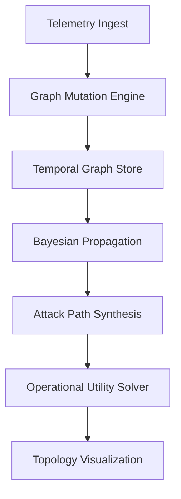
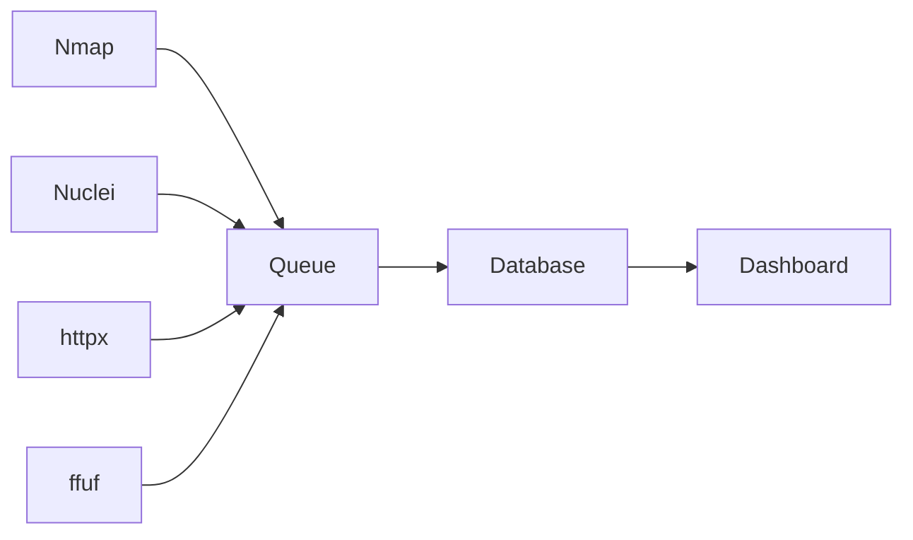
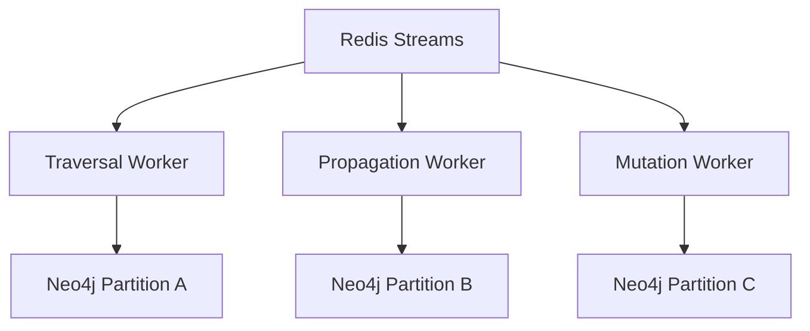
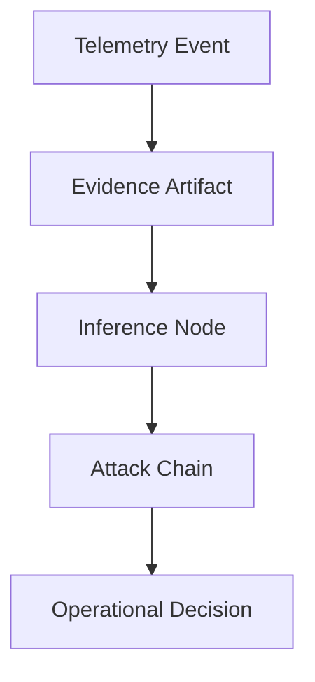

# Lattice9

<p align="center">
  
</p>

<p align="center">
  <strong>
    Graph-native offensive intelligence infrastructure for probabilistic attack-path reasoning,
    temporal topology cognition, and distributed adversarial computation.
  </strong>
</p>

---

<p align="center">
  
  
  
  
</p>

---

# Overview

Traditional offensive-security platforms optimize for:

* scan execution
* vulnerability aggregation
* dashboard visualization
* orchestration throughput

Lattice9 optimizes for:

* attack-path synthesis
* graph-native reasoning
* probabilistic traversal
* temporal infrastructure cognition
* operational attack economics
* topology-aware inference

Instead of treating infrastructure as disconnected findings,
Lattice9 models enterprise environments as:

$$
G_t = (V_t, E_t, W_t, \Phi_t)
$$

Where:

* $V_t$ = infrastructure entities
* $E_t$ = typed relationships
* $W_t$ = weighted operational semantics
* $\Phi_t$ = dynamic graph field state.

The platform transforms offensive analysis from:

```text
finding aggregation
```

into:

```text
stateful adversarial graph cognition.
```

---

# Architecture

<p align="center">
  
</p>



---

# Why Lattice9 Exists

Most offensive platforms are orchestration layers around disconnected tooling.

Typical architecture:



At scale this produces:

* topology blindness
* duplicated findings
* disconnected telemetry
* static prioritization
* analyst overload
* false-positive amplification

The system executes tools.

But it does not understand infrastructure.

Lattice9 attempts to solve that problem through:

* graph-native computation
* probabilistic reasoning
* attack-path inference
* topology-aware traversal
* temporal infrastructure modeling
* distributed graph computation

---

# Core Research Domains

| Domain                  | Capability                          |
| ----------------------- | ----------------------------------- |
| Graph Computation       | Weighted topology traversal         |
| Probabilistic Reasoning | Loopy Bayesian propagation          |
| Temporal Cognition      | Drift-aware infrastructure modeling |
| Attack Economics        | Utility-driven path optimization    |
| Distributed Systems     | Partitioned graph computation       |
| Evidence Lineage        | Cryptographic provenance DAGs       |
| Information Geometry    | Geodesic attack-path modeling       |
| Causal Inference        | Counterfactual attack simulation    |
| Infrastructure Topology | Trust relationship modeling         |
| Graph Mutation          | Event-driven recomputation          |

---

# Attack Path Computation

Traversal is no longer shortest-path.

Traversal becomes:

```text
expected offensive utility maximization
```

The traversal engine models:

* exploit feasibility
* detection probability
* operational cost
* privilege inheritance
* stealth viability
* persistence value
* graph resistance

Expected utility is computed as:

$$
\mathcal{U}(P)=
\frac{
\sum_{v \in P} PG(v)\cdot \prod_{e \in P}PP(e)
}{
DR(P)\cdot \sum_{e \in P}OC(e)
}
$$

Where:

* $PG(v)$ = privilege gain
* $PP(e)$ = propagation probability
* $DR(P)$ = detection risk
* $OC(e)$ = operational cost.

---

# Bayesian Propagation

<p align="center">
  
</p>

Infrastructure telemetry is probabilistic.

Credentials become stale.

Trust relationships drift.

Telemetry conflicts.

Instead of binary truth states, Lattice9 models confidence propagation using Bayesian graph inference.

$$
C_i(t+1)=\sigma\left(\sum_j W_{ji}C_j(t)-R_i\right)
$$

Where:

* $C_i$ = node confidence
* $W_{ji}$ = propagation influence
* $R_i$ = topology resistance.

Propagation systems include:

* damping stabilization
* oscillation suppression
* convergence detection
* partition-aware synchronization
* locality-aware recomputation

---

# Temporal Infrastructure Cognition

Infrastructure is not static.

Trust relationships mutate.

Credentials decay.

Attack surfaces drift over time.

Lattice9 models infrastructure as a temporal graph system.

$$
C_t(e)=C_0(e)e^{-\lambda(t-t_{last})}
$$

This enables:

* historical attack replay
* topology drift analysis
* confidence decay
* graph-state versioning
* replayable attack chains
* temporal attack simulation

---

# Distributed Graph Computation

<p align="center">
  
</p>

As infrastructure graphs scale, the bottleneck shifts from:

```text
scan throughput
```

into:

```text
graph recomputation
```

Lattice9 therefore uses:

* distributed traversal workers
* locality-aware graph partitioning
* event-driven recomputation
* asynchronous propagation
* frontier caching
* topology synchronization



---

# Evidence Lineage

Every inference inside the platform is traceable.

Lattice9 maintains evidence provenance DAGs for:

* replayability
* explainability
* causal traceability
* operational auditing
* deterministic replay



---

# Topology Resistance Theory

The platform models infrastructure resistance as:

* segmentation pressure
* monitoring density
* defensive friction
* traversal damping
* containment barriers

Traversal therefore bends around hardened regions instead of blindly selecting shortest-paths.

Graph Laplacian systems are used to model topology resistance:

$$
L = D_g - A
$$

Where:

* $D_g$ = degree matrix
* $A$ = adjacency matrix.

---

# Information Geometry

Lattice9 treats attack surfaces as computational manifolds.

Traversal becomes:

* geodesic optimization
* field-aware movement
* resistance-sensitive routing
* topology-constrained propagation.

This transforms attack-path analysis into:

```text
applied adversarial geometry.
```

---

# Local LLM Integration

LLMs are NOT the primary reasoning engine.

LLMs are used only for:

* semantic enrichment
* contextual explanation
* analyst assistance
* summarization
* operational translation.

Core reasoning remains:

* deterministic
* graph-native
* probabilistic
* topology-aware.

Supported:

* Ollama
* llama.cpp
* vLLM
* offline semantic enrichment
* air-gapped deployment

---

# Research Directions

Future research domains include:

* persistent homology
* Ricci curvature on attack graphs
* simplicial attack complexes
* graph field equations
* spectral topology analysis
* graph neural reasoning
* causal graph discovery
* attack-wave physics
* topology entropy systems

---

# Repository Structure

```text
/docs
    /whitepaper
    /architecture
    /math
    /operations
    /deployment
    /research

/server-py
/frontend
/graph
/workers
/assets
```

---

# Screenshots

## Operational Graph Console

<p align="center">
  
</p>

---

## Attack Path Visualization

<p align="center">
  
</p>

---

## Bayesian Field Propagation

<p align="center">
  
</p>

---

# Deployment

## Linux

```bash
git clone https://github.com/webspoilt/lattice9
cd lattice9
```

---

## Docker

```bash
docker compose up --build
```

---

## Neo4j

```bash
docker run \
  --name neo4j \
  -p7474:7474 -p7687:7687 \
  -d neo4j
```

---

## Redis Streams

```bash
docker run -p 6379:6379 redis
```

---

# Whitepaper

Full research paper:

```text
/docs/whitepaper/
```

Includes:

* graph theory appendix
* distributed systems appendix
* attack economics
* Bayesian propagation
* temporal cognition
* topology resistance theory
* operational attack modeling

---

# Final Statement

Lattice9 is not designed as:

* a scanner wrapper
* an AI dashboard
* a vulnerability management platform
* a penetration-testing SaaS product

It is designed as:

```text
probabilistic offensive graph cognition infrastructure.
```

The platform attempts to model:

* infrastructure relationships
* adversarial traversal
* attack economics
* temporal drift
* graph mutation
* operational topology

as computational systems.

---

<p align="center">
  <strong>
    Distributed adversarial graph computation.
  </strong>
</p>
