# Lattice9 Offensive Intelligence Operating System Architecture

> Target architecture for converting Lattice9 from an AI-assisted pentest dashboard into a stateful offensive intelligence engine.

## Executive Position

Lattice9 should own one deep capability first: **temporal attack-chain inference**.

That capability means the platform continuously turns authorized collection evidence into normalized entities, typed relationships, temporal graph state, and ranked attack paths with reproducible reasoning traces. The UI, scanners, LLM features, reports, and automations exist only to support that capability.

The platform must not persist a vulnerability, attack path, or exploitability claim unless it can answer:

- What evidence produced this?
- Which deterministic rule or validation changed its state?
- Which graph relationships make it operationally relevant?
- How did this differ from the previous known state?
- What would invalidate the conclusion?

LLMs may explain and summarize evidence. They must not create authoritative findings, invent exploitability, or act as autonomous exploit engines.

## Deliverables Index

| Requested Deliverable | Primary Section |
| --- | --- |
| 1. Full system architecture | System Architecture |
| 2. Data flow diagrams | Data Flow Diagrams |
| 3. Graph schema | Graph Schema |
| 4. Database schema | PostgreSQL Database Schema |
| 5. Threat model | Threat Model |
| 6. Offensive reasoning engine design | Offensive Reasoning Engine Design |
| 7. Temporal intelligence model | Temporal Intelligence Model |
| 8. Attack-path inference engine | Attack-Path Inference Engine |
| 9. Evidence lineage system | Evidence Lineage System |
| 10. False-positive suppression engine | False-Positive Suppression Engine |
| 11. Backend service decomposition | Backend Service Decomposition |
| 12. Queue architecture | Queue Architecture |
| 13. Memory model | Memory Model |
| 14. API design | API Design |
| 15. UI redesign philosophy | UI Redesign Philosophy |
| 16. Operational workflows | Operational Workflows |
| 17. Validation engine | Validation Engine |
| 18. Security hardening strategy | Security Hardening Strategy |
| 19. Scaling strategy | Scaling Strategy |
| 20. Professional-grade roadmap | Professional Roadmap |

## Current Project Assessment

The current repository has useful scaffolding, but the ownership model is wrong for the desired product.

- `drizzle/schema.ts` uses MySQL tables that store targets, recon lists, findings, reports, conversations, and thin graph entities. This must migrate to PostgreSQL and separate observations, normalized entities, evidence, temporal state, and decisions.
- `server-py/main.py` contains an in-memory NetworkX placeholder. This must become a stateless reasoning worker backed by PostgreSQL, Neo4j, Redis, and object storage.
- `server/routers/vulnerability.ts` allows LLM-generated findings to be persisted as findings. This must be replaced with deterministic candidate generation, evidence requirements, and validation state transitions.
- `client/src/pages/Lattice9Console.tsx` mixes target creation, scanner status, fake attack paths, an AI advisor, reports, and OWASP content. This should become a dense analyst workbench centered on attack paths, evidence lineage, temporal drift, and graph relationships.
- `docker-compose.yml` runs app, engine, and storage services. Target state needs PostgreSQL, Neo4j, Redis, and object storage.

The redesign below treats the existing Node/tRPC app as the initial API shell, the Python service as the reasoning and collection worker runtime, and the current React app as a workbench to be rebuilt around operational workflows.

## System Architecture

### Primary Architecture

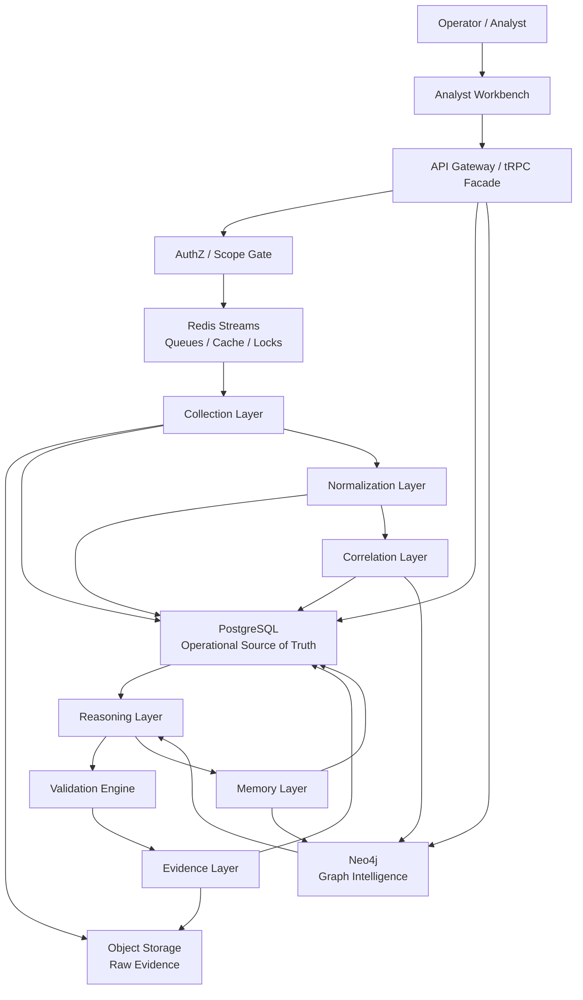

### Layer Contract

| Layer | Owns | Does Not Own |
| --- | --- | --- |
| Collection | Tool execution, passive recon, active recon, enrichment, raw evidence capture | Findings, exploitability claims, final entity identity |
| Normalization | Typed observations, parser outputs, canonical field extraction | Entity merge decisions, attack paths |
| Correlation | Entity resolution, duplicate clustering, inferred relationships | Scanner execution, exploit validation |
| Reasoning | Attack-chain generation, confidence scoring, privilege and impact reasoning | Raw tool parsing, UI presentation |
| Memory | Snapshots, drift, temporal state, historical replay | Current collection scheduling |
| Evidence | Provenance, raw artifacts, validation records, annotations | Confidence math, graph path search |

### Deep Capability Boundary

Build only the first-class workflow around temporal attack-chain inference:

1. Collect observations.
2. Normalize observations into facts.
3. Correlate facts into graph entities and typed edges.
4. Compare current graph state against historical state.
5. Generate attack-chain hypotheses.
6. Rank chains by feasibility, impact, confidence, and drift.
7. Validate claims with deterministic checks where safe and authorized.
8. Preserve evidence and reasoning trace.
9. Let analysts annotate, accept, reject, replay, or export the chain.

Everything else is secondary.

## Mandatory Layer Specifications

### 1. Collection Layer

**Purpose**

Collect authorized observations from scanners, passive sources, active probes, service fingerprinting, and enrichment providers while preserving execution metadata and raw evidence.

**Architecture**

- Worker runtime: Python collection workers for protocol-heavy tasks, Node workers for app-integrated jobs.
- Queue input: Redis Streams.
- Output: raw artifacts to object storage, execution metadata to PostgreSQL, normalized parser events to the Normalization Layer.
- Scope enforcement: every job must bind to an engagement, scope rule version, operator, and authorization record.

**Data Flow**

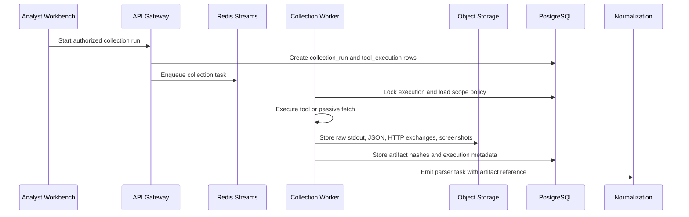

**Algorithms**

- Scope matching by normalized FQDN, CIDR containment, ASN ownership, and explicit exclusions.
- Rate limiting by target, ASN, organization, protocol, and collection type.
- Tool execution fingerprinting with command template hash, container image digest, environment hash, tool version, and input hash.
- Artifact hashing using SHA-256 for dedupe and tamper detection.

**Tradeoffs**

- Storing raw evidence increases cost but enables replay and audit.
- Containerized tools reduce host risk but add orchestration overhead.
- Strict scope gates slow ad hoc testing but prevent unauthorized execution.

**Limitations**

- Passive sources can be stale.
- Active probes can change target behavior or trigger defensive controls.
- Some tool outputs are unstable across versions and require parser versioning.

**Scaling Concerns**

- Partition jobs by engagement and collection type.
- Use worker concurrency limits per target and ASN.
- Store large artifacts in object storage, not PostgreSQL.
- Keep queue messages small and reference artifacts by URI and hash.

**Security Implications**

- Treat tool outputs as hostile input.
- Run collectors in sandboxed containers with egress policies.
- Encrypt raw evidence at rest.
- Record explicit authorization before any active collection.

### 2. Normalization Layer

**Purpose**

Convert tool-specific outputs into normalized observations, typed entities, and graph-compatible candidate relationships without making final reasoning claims.

**Architecture**

- Parser registry keyed by `tool_name`, `tool_version`, `artifact_type`, and `parser_version`.
- Canonical observation model stored in PostgreSQL.
- JSON Schema validation for every parser output.
- Failed parser outputs route to a parser dead-letter queue with artifact pointers.

**Data Flow**

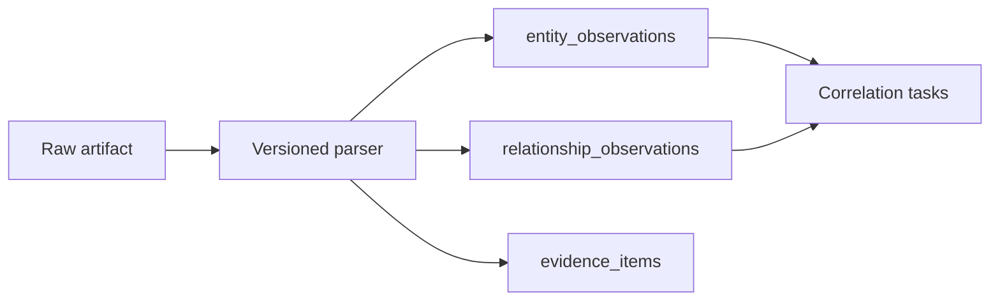

**Algorithms**

- Canonicalization for FQDNs, IPs, URLs, service names, protocol versions, CVE IDs, CWEs, package names, and identities.
- Parser confidence defaults based on source reliability and artifact fidelity.
- Observation keys using deterministic hashes:
  - `entity_observation_key = sha256(engagement_id, entity_type, canonical_value, source_artifact_hash, parser_version)`
  - `relationship_observation_key = sha256(source_candidate, relationship_type, target_candidate, evidence_hash)`
- Lossless raw-to-normalized mapping through evidence spans and byte offsets when possible.

**Tradeoffs**

- Strict schemas reject messy tool outputs, but prevent poisoning the graph with malformed facts.
- Keeping observations separate from entities creates more tables, but preserves evidence and avoids premature merges.

**Limitations**

- Some scanners produce ambiguous service names.
- Fingerprints often infer technology from weak signals.
- Normalization cannot resolve ownership without correlation context.

**Scaling Concerns**

- Parser workers are embarrassingly parallel.
- Use batch inserts and conflict handling for high-volume observations.
- Partition observation tables by engagement and time.

**Security Implications**

- Parser sandboxing is required for untrusted artifacts.
- Reject embedded active content in HTML, SVG, PDFs, and screenshots before rendering.
- Store parser failures without exposing raw content to the UI by default.

### 3. Correlation Layer

**Purpose**

Resolve observations into durable entities and infer relationships such as ownership, containment, service exposure, trust, dependency, identity mapping, and duplicate clusters.

**Architecture**

- PostgreSQL stores canonical entities, relationships, merge decisions, and confidence history.
- Neo4j stores graph projections optimized for traversal and path reasoning.
- Correlation runs are deterministic and versioned.
- Manual analyst merges override automated merges but remain auditable.

**Data Flow**

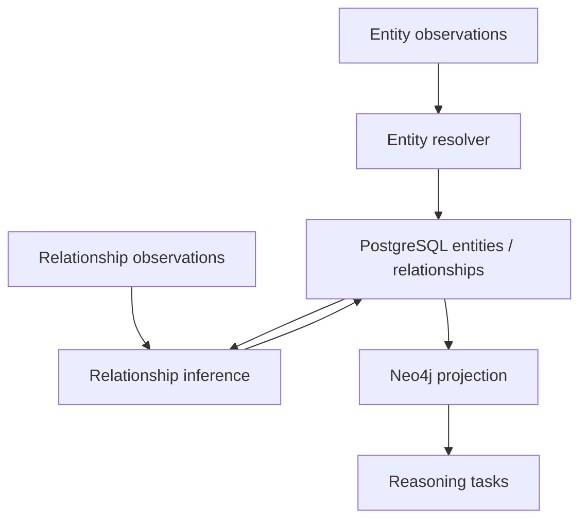

**Algorithms**

- Entity resolution:
  - Deterministic keys for exact identifiers such as IP, FQDN, certificate fingerprint, cloud resource ID, email, username SID, CVE.
  - Weighted similarity for weak identity signals such as page titles, banners, TLS issuer, favicon hash, ASN, nameserver reuse, and deployment fingerprints.
  - Union-find for merge clusters with reversible merge events.
- Infrastructure inheritance:
  - Host inherits subnet, ASN, cloud account, certificate, DNS zone, and owner edges when evidence supports them.
  - Service inherits host exposure and trust-zone context.
  - Vulnerability inherits service and package context, not target context directly.
- Relationship scoring:
  - `edge_confidence = source_reliability * evidence_strength * freshness_decay * consistency_factor`
  - Conflicting evidence reduces confidence rather than deleting the edge.
- Duplicate clustering:
  - Findings cluster by normalized weakness type, affected service, evidence signature, and exploit preconditions.

**Tradeoffs**

- Conservative merge thresholds reduce false joins but increase duplicate entities.
- Rich relationship modeling improves reasoning but can create graph density problems.
- Reversible merges require more storage but protect analyst trust.

**Limitations**

- Ownership inference can be wrong in shared hosting, CDN, or cloud environments.
- Trust inference from external data is weak unless validated by identity or protocol evidence.
- Relationship confidence is only as reliable as source weighting and recency.

**Scaling Concerns**

- Keep Neo4j as a projection, not the sole source of truth.
- Rebuild graph projections per engagement when schema versions change.
- Use incremental projection updates for new observations.
- Cap inferred relationship fan-out with type-specific thresholds.

**Security Implications**

- Graph poisoning is a real risk; every inferred edge must cite evidence.
- Analyst merge actions require RBAC and audit trails.
- Cross-tenant correlation is disabled unless explicitly configured for managed service providers.

### 4. Reasoning Layer

**Purpose**

Generate ranked attack-chain hypotheses from graph state, validated vulnerabilities, trust relationships, privileges, identity exposure, and temporal drift.

**Architecture**

- Python reasoning workers for graph algorithms and scoring.
- Neo4j for graph traversal.
- PostgreSQL for evidence, rules, attack path persistence, and audit.
- Rule registry for deterministic inference rules.
- LLM interpretation runs as a separate advisory stage and cannot mutate authoritative facts.

**Data Flow**

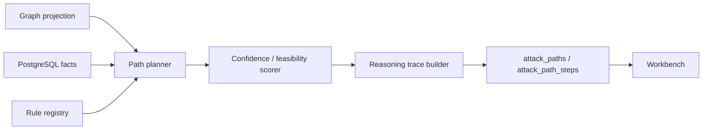

**Algorithms**

- Candidate generation:
  - Entry nodes: internet-exposed services, externally reachable identities, public endpoints, exposed management surfaces.
  - Objective nodes: crown-jewel systems, privileged identities, admin services, sensitive data stores, high-centrality trust hubs.
  - Edges: `CAN_REACH`, `EXPOSES_SERVICE`, `HAS_VULNERABILITY`, `AUTHENTICATES_TO`, `TRUSTS`, `GRANTS_PRIVILEGE`, `DEPENDS_ON`, `SAME_OWNER_AS`.
- Path search:
  - Weighted shortest path for initial route discovery.
  - Yen k-shortest paths for alternatives.
  - A* when objective class is known and graph is large.
  - Cycle controls for trust loops and subnet fan-out.
- Path probability:
  - `path_confidence = product(edge_confidence adjusted for correlation groups)`
  - `path_feasibility = f(validation_state, required_access, exploit_maturity, service_exposure, auth_requirement, compensating_controls)`
  - `path_priority = impact_score * feasibility_score * confidence_score * temporal_multiplier`
- Explanation:
  - Every path step stores rule ID, input facts, evidence IDs, confidence delta, and rejection conditions.

**Tradeoffs**

- Deterministic reasoning is less flashy than an AI agent, but it is reviewable and repeatable.
- Conservative scoring may miss creative chains; analyst annotations can promote hypotheses.
- Graph traversal speed depends on relationship discipline.

**Limitations**

- The engine estimates feasibility; it does not prove compromise.
- Unknown compensating controls can make apparently strong paths invalid.
- Identity and privilege modeling is weak without authenticated or directory-specific telemetry.

**Scaling Concerns**

- Precompute high-value entry and objective nodes.
- Cache neighborhood expansions.
- Limit path depth by engagement profile.
- Run expensive path synthesis asynchronously and stream partial ranked results.

**Security Implications**

- Attack-path details are sensitive and require strict RBAC.
- Validation actions must pass scope and safety policies.
- LLM summaries must quote evidence references and must be marked advisory.

### 5. Memory Layer

**Purpose**

Persist historical infrastructure state, temporal snapshots, graph diffs, exploitability timelines, and behavioral drift.

**Architecture**

- PostgreSQL bitemporal records for entities, relationships, findings, and validation state.
- Neo4j snapshot metadata and projected current graph.
- Object storage for snapshot exports and replay bundles.
- Scheduled snapshot workers and event-triggered diff workers.

**Data Flow**

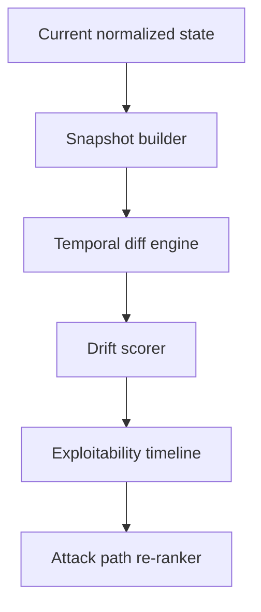

**Algorithms**

- Slowly changing dimensions for entity and relationship state.
- Temporal graph diff:
  - Added, removed, changed, and reweighted nodes and edges.
  - Exposure drift: externally reachable services added or privilege boundary weakened.
  - Exploitability drift: vulnerability state changed because service version, validation status, exploit maturity, or compensating control changed.
- Freshness decay:
  - High-confidence observations decay slower than weak passive observations.
  - Validation state can expire based on rule-specific TTL.
- Drift score:
  - `drift_score = exposure_delta + privilege_delta + vulnerability_delta + trust_delta + centrality_delta`

**Tradeoffs**

- Bitemporal storage is more complex, but supports replay and audit.
- Snapshotting everything is costly; incremental diffs are harder but scale better.

**Limitations**

- Historical absence of evidence is not evidence of absence.
- Short-lived assets can appear as noise unless collection cadence is tuned.
- Snapshot comparisons can be misleading after major scope changes.

**Scaling Concerns**

- Partition snapshots by engagement and time.
- Keep hot state in PostgreSQL and archive old snapshot bundles to object storage.
- Recompute centrality metrics asynchronously.

**Security Implications**

- Historical data can expose old weaknesses and must have the same protection as current findings.
- Snapshot export requires watermarking and audit.
- Retention rules must respect client contracts.

### 6. Evidence Layer

**Purpose**

Maintain immutable evidence lineage from raw artifact through observation, relationship, finding, validation, attack path, annotation, and report.

**Architecture**

- Object storage contains immutable raw artifacts.
- PostgreSQL stores evidence metadata, artifact hashes, chain-of-custody, validation state, and analyst annotations.
- UI renders evidence through sanitized viewers.
- Reports cite evidence IDs, not copied raw blobs.

**Data Flow**

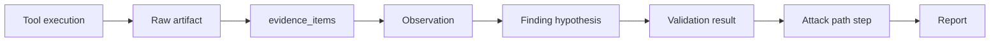

**Algorithms**

- Content-addressed storage with SHA-256.
- Evidence trust levels:
  - `direct`: raw response, authenticated observation, scanner proof.
  - `derived`: parsed field, normalized observation, correlation output.
  - `inferred`: relationship or attack path step produced by rules.
  - `advisory`: LLM summary or analyst note.
- Validation state machine:
  - `unvalidated -> candidate -> validated -> contradicted -> expired -> accepted_false_positive`.

**Tradeoffs**

- Immutable evidence means mistakes are corrected by new records, not mutation.
- Full lineage adds storage and UI complexity but is required for credibility.

**Limitations**

- Some evidence cannot be safely stored verbatim, such as secrets or personal data.
- Redaction can weaken reproducibility unless redaction hashes are preserved.

**Scaling Concerns**

- Deduplicate artifacts by hash.
- Use lifecycle policies for old raw artifacts.
- Cache sanitized previews.

**Security Implications**

- Evidence may contain credentials, tokens, PII, and client secrets.
- Store secrets with field-level encryption and redaction flags.
- Require explicit privilege to download raw evidence.

## Graph Schema

Neo4j is recommended initially because its query model maps well to operator workflows and BloodHound-style reasoning. ArangoDB is viable if document and graph storage must be consolidated, but the first implementation should keep PostgreSQL as source of truth and Neo4j as graph projection.

### Node Labels

| Label | Purpose | Required Properties |
| --- | --- | --- |
| `Tenant` | Isolation boundary | `tenant_id`, `name` |
| `Engagement` | Authorized operation | `engagement_id`, `name`, `status`, `scope_version` |
| `ScopeRule` | Include/exclude policy | `scope_rule_id`, `type`, `pattern`, `valid_from` |
| `Asset` | Abstract target-owned object | `entity_id`, `asset_type`, `canonical_name`, `confidence` |
| `Domain` | DNS name or zone | `entity_id`, `fqdn`, `registered_domain` |
| `Host` | Host instance | `entity_id`, `hostname`, `ip`, `cloud_id` |
| `IPAddress` | IP address | `entity_id`, `ip`, `version` |
| `Subnet` | CIDR block | `entity_id`, `cidr` |
| `ASN` | Autonomous system | `entity_id`, `asn`, `org` |
| `Service` | Network service | `entity_id`, `protocol`, `port`, `service_name`, `version` |
| `Endpoint` | HTTP/API/resource endpoint | `entity_id`, `method`, `path`, `auth_required` |
| `Identity` | User, group, service account | `entity_id`, `identity_type`, `principal`, `realm` |
| `Credential` | Credential material metadata | `entity_id`, `credential_type`, `redacted`, `validity_state` |
| `Vulnerability` | Weakness or CVE | `entity_id`, `vuln_key`, `cwe`, `cvss_base` |
| `Finding` | Environment-specific weakness hypothesis | `finding_id`, `state`, `confidence`, `validation_state` |
| `Evidence` | Evidence pointer | `evidence_id`, `hash`, `source_type`, `captured_at` |
| `AttackPath` | Persisted chain | `attack_path_id`, `priority`, `confidence`, `feasibility` |
| `Technique` | ATT&CK or internal technique class | `technique_id`, `name`, `phase` |
| `TrustZone` | Inferred network or identity boundary | `entity_id`, `zone_type`, `confidence` |
| `Snapshot` | Temporal graph snapshot marker | `snapshot_id`, `captured_at`, `graph_version` |

### Relationship Types

| Relationship | Source -> Target | Meaning |
| --- | --- | --- |
| `IN_SCOPE` | Entity -> Engagement | Entity is governed by current scope |
| `OBSERVED_IN` | Entity/Relationship -> Snapshot | State existed in snapshot |
| `EVIDENCED_BY` | Entity/Relationship/Finding -> Evidence | Evidence supports claim |
| `RESOLVES_TO` | Domain -> IPAddress | DNS resolution observed |
| `HOSTS` | Host -> Service | Host exposes service |
| `EXPOSES` | Service -> Endpoint | Service exposes endpoint |
| `IN_SUBNET` | IPAddress -> Subnet | IP containment |
| `IN_ASN` | IPAddress/Subnet -> ASN | ASN ownership |
| `OWNS` | Tenant/Org -> Asset | Ownership or stewardship |
| `SAME_OWNER_AS` | Asset -> Asset | Inferred shared ownership |
| `DEPENDS_ON` | Service -> Service | Runtime or protocol dependency |
| `CAN_REACH` | Asset/Service -> Service | Network reachability |
| `AUTHENTICATES_TO` | Identity/Credential -> Service | Authentication relationship |
| `TRUSTS` | Service/Identity/Zone -> Service/Identity/Zone | Trust relationship |
| `HAS_VULNERABILITY` | Service/Endpoint/Host -> Vulnerability | Weakness applies to entity |
| `MATERIALIZES_AS` | Vulnerability -> Finding | Weakness exists in this environment |
| `VALIDATED_BY` | Finding -> Evidence | Deterministic validation evidence |
| `ENABLES` | Finding/Technique -> Technique/Finding | One step enables another |
| `REQUIRES_PRIVILEGE` | Technique/Finding -> Identity/Privilege | Precondition |
| `GRANTS_PRIVILEGE` | Finding/Technique -> Identity/Privilege | Postcondition |
| `PART_OF_PATH` | Finding/Technique/Entity -> AttackPath | Included in chain |
| `CHANGED_TO` | Entity/Relationship -> Entity/Relationship | Temporal transition |

### Edge Properties

Every graph edge must include:

- `relationship_id`
- `engagement_id`
- `confidence`
- `weight`
- `first_seen_at`
- `last_seen_at`
- `valid_from`
- `valid_to`
- `source_rule_id`
- `evidence_ids`
- `projection_version`

### Neo4j Constraints

```cypher
CREATE CONSTRAINT entity_id_unique IF NOT EXISTS
FOR (n:Asset) REQUIRE n.entity_id IS UNIQUE;

CREATE CONSTRAINT service_id_unique IF NOT EXISTS
FOR (n:Service) REQUIRE n.entity_id IS UNIQUE;

CREATE CONSTRAINT finding_id_unique IF NOT EXISTS
FOR (n:Finding) REQUIRE n.finding_id IS UNIQUE;

CREATE INDEX relationship_confidence IF NOT EXISTS
FOR ()-[r]-() ON (r.confidence);
```

## PostgreSQL Database Schema

PostgreSQL is the operational source of truth. Neo4j stores query projections, not irreplaceable data. Use `uuid`, `jsonb`, generated columns for canonical keys, `timestamptz`, and partitioning by `engagement_id` and time for high-volume tables.

### Core Operational Tables

```sql
CREATE TYPE severity AS ENUM ('critical', 'high', 'medium', 'low', 'info');
CREATE TYPE validation_state AS ENUM (
  'unvalidated',
  'candidate',
  'validated',
  'contradicted',
  'expired',
  'accepted_false_positive'
);

CREATE TABLE tenants (
  id uuid PRIMARY KEY,
  name text NOT NULL,
  created_at timestamptz NOT NULL DEFAULT now()
);

CREATE TABLE users (
  id uuid PRIMARY KEY,
  tenant_id uuid NOT NULL REFERENCES tenants(id),
  email text NOT NULL,
  display_name text,
  role text NOT NULL,
  created_at timestamptz NOT NULL DEFAULT now(),
  UNIQUE (tenant_id, email)
);

CREATE TABLE engagements (
  id uuid PRIMARY KEY,
  tenant_id uuid NOT NULL REFERENCES tenants(id),
  name text NOT NULL,
  status text NOT NULL,
  scope_version integer NOT NULL DEFAULT 1,
  authorization_statement text NOT NULL,
  authorization_hash text NOT NULL,
  starts_at timestamptz,
  ends_at timestamptz,
  created_by uuid NOT NULL REFERENCES users(id),
  created_at timestamptz NOT NULL DEFAULT now()
);

CREATE TABLE scope_rules (
  id uuid PRIMARY KEY,
  engagement_id uuid NOT NULL REFERENCES engagements(id),
  version integer NOT NULL,
  rule_type text NOT NULL CHECK (rule_type IN ('include', 'exclude')),
  target_type text NOT NULL CHECK (target_type IN ('fqdn', 'cidr', 'asn', 'url', 'cloud_account')),
  pattern text NOT NULL,
  reason text,
  created_at timestamptz NOT NULL DEFAULT now()
);
```

### Collection And Evidence

```sql
CREATE TABLE collection_runs (
  id uuid PRIMARY KEY,
  engagement_id uuid NOT NULL REFERENCES engagements(id),
  requested_by uuid NOT NULL REFERENCES users(id),
  collection_profile text NOT NULL,
  scope_version integer NOT NULL,
  status text NOT NULL,
  started_at timestamptz,
  finished_at timestamptz,
  created_at timestamptz NOT NULL DEFAULT now()
);

CREATE TABLE tool_executions (
  id uuid PRIMARY KEY,
  collection_run_id uuid NOT NULL REFERENCES collection_runs(id),
  tool_name text NOT NULL,
  tool_version text NOT NULL,
  command_template_hash text NOT NULL,
  container_image_digest text,
  input_hash text NOT NULL,
  exit_code integer,
  status text NOT NULL,
  started_at timestamptz,
  finished_at timestamptz
);

CREATE TABLE evidence_items (
  id uuid PRIMARY KEY,
  engagement_id uuid NOT NULL REFERENCES engagements(id),
  tool_execution_id uuid REFERENCES tool_executions(id),
  source_type text NOT NULL,
  artifact_uri text NOT NULL,
  sha256 text NOT NULL,
  mime_type text,
  captured_at timestamptz NOT NULL,
  redaction_state text NOT NULL DEFAULT 'none',
  metadata jsonb NOT NULL DEFAULT '{}',
  UNIQUE (engagement_id, sha256)
);
```

### Entities, Observations, And Relationships

```sql
CREATE TABLE entities (
  id uuid PRIMARY KEY,
  engagement_id uuid NOT NULL REFERENCES engagements(id),
  entity_type text NOT NULL,
  canonical_key text NOT NULL,
  display_name text NOT NULL,
  confidence numeric(5,4) NOT NULL,
  first_seen_at timestamptz NOT NULL,
  last_seen_at timestamptz NOT NULL,
  valid_from timestamptz NOT NULL,
  valid_to timestamptz,
  attributes jsonb NOT NULL DEFAULT '{}',
  UNIQUE (engagement_id, entity_type, canonical_key)
);

CREATE TABLE entity_observations (
  id uuid PRIMARY KEY,
  engagement_id uuid NOT NULL REFERENCES engagements(id),
  entity_id uuid REFERENCES entities(id),
  candidate_type text NOT NULL,
  canonical_value text NOT NULL,
  parser_name text NOT NULL,
  parser_version text NOT NULL,
  evidence_id uuid NOT NULL REFERENCES evidence_items(id),
  confidence numeric(5,4) NOT NULL,
  observed_at timestamptz NOT NULL,
  attributes jsonb NOT NULL DEFAULT '{}'
);

CREATE TABLE relationships (
  id uuid PRIMARY KEY,
  engagement_id uuid NOT NULL REFERENCES engagements(id),
  source_entity_id uuid NOT NULL REFERENCES entities(id),
  target_entity_id uuid NOT NULL REFERENCES entities(id),
  relationship_type text NOT NULL,
  confidence numeric(5,4) NOT NULL,
  weight numeric(8,4) NOT NULL,
  source_rule_id text,
  first_seen_at timestamptz NOT NULL,
  last_seen_at timestamptz NOT NULL,
  valid_from timestamptz NOT NULL,
  valid_to timestamptz,
  attributes jsonb NOT NULL DEFAULT '{}'
);

CREATE TABLE relationship_evidence (
  relationship_id uuid NOT NULL REFERENCES relationships(id),
  evidence_id uuid NOT NULL REFERENCES evidence_items(id),
  support_type text NOT NULL,
  PRIMARY KEY (relationship_id, evidence_id)
);
```

### Offensive Intelligence Tables

```sql
CREATE TABLE vulnerabilities (
  id uuid PRIMARY KEY,
  vuln_key text NOT NULL,
  vuln_type text NOT NULL,
  cve text,
  cwe text,
  cvss_base numeric(3,1),
  exploit_maturity text,
  references jsonb NOT NULL DEFAULT '[]',
  UNIQUE (vuln_key)
);

CREATE TABLE findings (
  id uuid PRIMARY KEY,
  engagement_id uuid NOT NULL REFERENCES engagements(id),
  affected_entity_id uuid NOT NULL REFERENCES entities(id),
  vulnerability_id uuid REFERENCES vulnerabilities(id),
  title text NOT NULL,
  severity severity NOT NULL,
  confidence numeric(5,4) NOT NULL,
  validation_state validation_state NOT NULL DEFAULT 'unvalidated',
  environmental_relevance numeric(5,4) NOT NULL DEFAULT 0,
  duplicate_cluster_id uuid,
  first_seen_at timestamptz NOT NULL,
  last_seen_at timestamptz NOT NULL,
  status text NOT NULL DEFAULT 'open',
  attributes jsonb NOT NULL DEFAULT '{}'
);

CREATE TABLE finding_evidence (
  finding_id uuid NOT NULL REFERENCES findings(id),
  evidence_id uuid NOT NULL REFERENCES evidence_items(id),
  role text NOT NULL CHECK (role IN ('supporting', 'contradicting', 'validation', 'context')),
  confidence_delta numeric(6,4) NOT NULL DEFAULT 0,
  PRIMARY KEY (finding_id, evidence_id, role)
);

CREATE TABLE attack_paths (
  id uuid PRIMARY KEY,
  engagement_id uuid NOT NULL REFERENCES engagements(id),
  snapshot_id uuid,
  objective_entity_id uuid REFERENCES entities(id),
  entry_entity_id uuid REFERENCES entities(id),
  title text NOT NULL,
  confidence numeric(5,4) NOT NULL,
  feasibility numeric(5,4) NOT NULL,
  impact numeric(5,4) NOT NULL,
  priority numeric(8,4) NOT NULL,
  state text NOT NULL DEFAULT 'candidate',
  reasoning_trace jsonb NOT NULL,
  created_at timestamptz NOT NULL DEFAULT now()
);

CREATE TABLE attack_path_steps (
  id uuid PRIMARY KEY,
  attack_path_id uuid NOT NULL REFERENCES attack_paths(id),
  step_index integer NOT NULL,
  source_entity_id uuid REFERENCES entities(id),
  relationship_id uuid REFERENCES relationships(id),
  target_entity_id uuid REFERENCES entities(id),
  finding_id uuid REFERENCES findings(id),
  rule_id text NOT NULL,
  confidence_delta numeric(6,4) NOT NULL,
  explanation text NOT NULL,
  evidence_ids uuid[] NOT NULL DEFAULT '{}',
  UNIQUE (attack_path_id, step_index)
);
```

### Temporal And Collaboration Tables

```sql
CREATE TABLE graph_snapshots (
  id uuid PRIMARY KEY,
  engagement_id uuid NOT NULL REFERENCES engagements(id),
  graph_version text NOT NULL,
  snapshot_type text NOT NULL,
  captured_at timestamptz NOT NULL,
  entity_count integer NOT NULL,
  relationship_count integer NOT NULL,
  artifact_uri text,
  metadata jsonb NOT NULL DEFAULT '{}'
);

CREATE TABLE temporal_diffs (
  id uuid PRIMARY KEY,
  engagement_id uuid NOT NULL REFERENCES engagements(id),
  from_snapshot_id uuid REFERENCES graph_snapshots(id),
  to_snapshot_id uuid REFERENCES graph_snapshots(id),
  diff_type text NOT NULL,
  affected_entity_id uuid REFERENCES entities(id),
  affected_relationship_id uuid REFERENCES relationships(id),
  drift_score numeric(8,4) NOT NULL,
  explanation text NOT NULL,
  evidence_ids uuid[] NOT NULL DEFAULT '{}',
  created_at timestamptz NOT NULL DEFAULT now()
);

CREATE TABLE validation_runs (
  id uuid PRIMARY KEY,
  engagement_id uuid NOT NULL REFERENCES engagements(id),
  finding_id uuid REFERENCES findings(id),
  requested_by uuid NOT NULL REFERENCES users(id),
  validator_id text NOT NULL,
  safety_policy_version text NOT NULL,
  status text NOT NULL,
  result_state validation_state,
  started_at timestamptz,
  finished_at timestamptz,
  metadata jsonb NOT NULL DEFAULT '{}'
);

CREATE TABLE annotations (
  id uuid PRIMARY KEY,
  engagement_id uuid NOT NULL REFERENCES engagements(id),
  author_id uuid NOT NULL REFERENCES users(id),
  subject_type text NOT NULL,
  subject_id uuid NOT NULL,
  body text NOT NULL,
  created_at timestamptz NOT NULL DEFAULT now()
);

CREATE TABLE audit_events (
  id uuid PRIMARY KEY,
  tenant_id uuid NOT NULL REFERENCES tenants(id),
  actor_id uuid REFERENCES users(id),
  action text NOT NULL,
  subject_type text NOT NULL,
  subject_id text NOT NULL,
  ip inet,
  user_agent text,
  metadata jsonb NOT NULL DEFAULT '{}',
  created_at timestamptz NOT NULL DEFAULT now()
);
```

## Offensive Reasoning Engine Design

### Components

| Component | Purpose | Output |
| --- | --- | --- |
| Fact Loader | Pull current and historical facts from PostgreSQL and graph projection | Typed in-memory fact set |
| Graph Adapter | Query Neo4j neighborhoods and relationship weights | Candidate subgraphs |
| Rule Registry | Versioned deterministic inference rules | Rule outcomes with evidence |
| Hypothesis Generator | Produce candidate chain fragments | Candidate steps |
| Path Planner | Assemble fragments into end-to-end paths | Candidate attack paths |
| Confidence Engine | Score facts, edges, findings, and paths | Numeric scores and variance |
| Explainer | Build reasoning traces | Human-auditable path explanation |
| Rejection Engine | Record why paths were discarded | Negative reasoning evidence |

### Rule Format

Rules must be data-driven and versioned:

```yaml
id: service.vulnerability.enables.initial_access.v1
inputs:
  source:
    type: Service
    predicates:
      - externally_reachable == true
  finding:
    validation_state:
      any_of: [candidate, validated]
  edge:
    type: HAS_VULNERABILITY
outputs:
  relationship_type: ENABLES
  technique_class: initial_access
scoring:
  confidence: edge.confidence * finding.confidence
  feasibility: finding.environmental_relevance * exposure_score
explanation: "Externally reachable service has an applicable finding with supporting evidence."
```

### Confidence Model

Use log-odds internally to avoid confidence inflation:

```text
logit(p) = ln(p / (1 - p))
combined = prior_logit + sum(weighted_evidence_logits) - contradiction_penalty
p = 1 / (1 + exp(-combined))
```

Use Noisy-OR only for independent supporting evidence. Evidence from the same source family must be correlated and downweighted.

### Reasoning Trace

Every attack path stores:

- `rule_id`
- `rule_version`
- `input_entities`
- `input_relationships`
- `input_findings`
- `evidence_ids`
- `confidence_before`
- `confidence_after`
- `confidence_delta`
- `assumptions`
- `contradictions`
- `operator_actions_available`
- `what_would_disprove_this`

## Temporal Intelligence Model

### Temporal Principles

- Current state is a view over historical evidence, not a replacement for history.
- Every entity and relationship has `first_seen_at`, `last_seen_at`, `valid_from`, and `valid_to`.
- Every finding has an exploitability timeline.
- Every attack path is tied to the graph snapshot that produced it.

### Snapshot Types

| Snapshot Type | Trigger | Purpose |
| --- | --- | --- |
| `scheduled` | Time interval | Baseline drift detection |
| `collection_completed` | Collection run finished | Compare pre/post collection state |
| `validation_completed` | Validation changes finding state | Re-rank paths |
| `scope_changed` | Scope version changes | Prevent invalid historical comparisons |
| `manual_checkpoint` | Analyst request | Reproducible reporting state |

### Drift Categories

| Drift | Example | Priority Impact |
| --- | --- | --- |
| Exposure drift | New internet-facing service appears | Raises entry-node score |
| Identity drift | New service account or auth realm appears | Raises privilege graph interest |
| Trust drift | New dependency or authentication edge | Raises lateral movement potential |
| Vulnerability drift | Finding appears, disappears, validates, or expires | Re-ranks path feasibility |
| Ownership drift | Asset moves across ASN, cloud account, or certificate | Changes correlation confidence |
| Behavior drift | Same endpoint changes auth, headers, status, or response class | Raises anomaly score |

### Temporal Diff Algorithm

```text
1. Load snapshot A and snapshot B.
2. Compare canonical entity keys.
3. Compare relationship tuples: source, type, target.
4. Classify added, removed, changed, and reweighted graph elements.
5. Recompute centrality deltas for affected neighborhoods.
6. Recompute finding environmental relevance for changed services.
7. Re-rank attack paths touching affected nodes or relationships.
8. Emit temporal_diffs with evidence IDs and explanations.
```

## Attack-Path Inference Engine

### Path Model

An attack path is not a scanner result. It is a graph-derived hypothesis:

```text
entry entity -> relationship -> finding or technique -> privilege or reachability gain -> objective
```

Each step must have:

- Precondition.
- Deterministic evidence.
- Rule ID.
- Expected state transition.
- Confidence delta.
- Validation status.
- Failure mode.

### Edge Cost

```text
edge_cost =
  -ln(edge_confidence)
  + auth_requirement_penalty
  + validation_uncertainty_penalty
  + freshness_decay_penalty
  + scope_risk_penalty
  - impact_gain_bonus
```

### Path Ranking

```text
priority =
  impact_score
  * feasibility_score
  * confidence_score
  * temporal_multiplier
  * centrality_multiplier
  * scope_safety_multiplier
```

Where:

- `impact_score` measures objective value, privilege gain, and blast radius.
- `feasibility_score` measures prerequisites, validation, exploit maturity, and compensating controls.
- `confidence_score` measures evidence convergence and contradiction penalties.
- `temporal_multiplier` boosts newly emerged, newly validated, or rapidly changing exposure.
- `centrality_multiplier` boosts paths through trust hubs.
- `scope_safety_multiplier` suppresses ambiguous scope.

### Search Strategy

1. Identify entry nodes from exposure graph.
2. Identify objective nodes from crown-jewel tags, high centrality, privileged identities, sensitive services, and analyst-defined objectives.
3. Build a constrained subgraph around entry and objective nodes.
4. Expand only edges with sufficient confidence or analyst override.
5. Run k-shortest path by edge cost.
6. Reject paths with missing evidence, invalid scope, unresolved prerequisites, or excessive uncertainty.
7. Persist top paths with full reasoning traces.

### Rejection Is A Feature

Rejected paths are stored with rejection reasons:

- Missing evidence.
- Contradictory evidence.
- Out of scope.
- Dependency unverified.
- Validation expired.
- Confidence below threshold.
- Requires unknown credentials or privileges.

This prevents the same weak hypotheses from reappearing without new evidence.

## Evidence Lineage System

### Chain Of Custody

Every displayed claim is traceable:

```text
attack_path_step
  -> finding or relationship
  -> observation
  -> evidence_item
  -> tool_execution
  -> collection_run
  -> scope_rule_version
  -> authorization record
```

### Evidence Viewer Requirements

- Show raw artifact hash, capture time, source tool, parser version, and redaction state.
- Show supporting and contradicting evidence separately.
- Show validation history.
- Allow analyst annotation without mutating evidence.
- Allow replay bundle generation for authorized users.

### Reproducibility Metadata

Store:

- Tool name and version.
- Container image digest.
- Command template hash.
- Input target canonical key.
- Scope version.
- Environment variables hash.
- Parser name and version.
- Worker version.
- Raw artifact URI and SHA-256.

## False-Positive Suppression Engine

### Purpose

Reduce noise by requiring environmental relevance, evidence convergence, duplicate suppression, and validation state transitions.

### Architecture

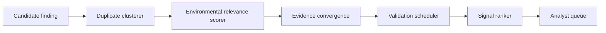

### Algorithms

- Duplicate suppression:
  - Cluster by affected entity, vulnerability key, normalized endpoint, evidence signature, and source family.
- Environmental relevance:
  - Boost findings on exposed, high-centrality, authenticated, or privilege-bearing services.
  - Suppress findings on unreachable, deprecated, dead, or out-of-scope assets.
- Confidence propagation:
  - Supporting evidence increases confidence only if source families are independent.
  - Contradicting evidence applies explicit penalties.
- Validation state:
  - Unvalidated scanner output remains a candidate.
  - Validated findings become path-eligible.
  - Expired findings must be revalidated before high-priority path use.
- Signal ranking:
  - Rank by impact, feasibility, confidence, drift, and analyst objectives.

### Tradeoffs

- Strict validation reduces noise but delays surfacing some true issues.
- Duplicate clustering may hide variants if keys are too broad.
- Environmental relevance can under-rank isolated but legally important findings.

### Limitations

- No scoring model can fully know business impact without analyst input.
- Some exploitability conditions require manual validation.
- Tool-specific false positives need curated suppression rules.

### Scaling Concerns

- Cluster incrementally by affected entity.
- Cache entity context features.
- Recompute rankings only for changed neighborhoods.

### Security Implications

- Suppression rules can hide real risk if abused.
- Analyst false-positive decisions require audit and optional peer review.
- LLM summaries must never change validation state.

## Backend Service Decomposition

| Service | Purpose | Data Flow | Algorithms | Tradeoffs | Limitations | Scaling | Security |
| --- | --- | --- | --- | --- | --- | --- | --- |
| API Gateway | UI-facing tRPC or REST facade | UI -> API -> PostgreSQL/Neo4j/Redis | RBAC, scope checks, pagination | Keeps UI simple | Can become monolith | Split read/write routes | Enforce tenant isolation |
| Auth And Scope Service | Authorization, RBAC, engagement scope | API/Workers -> scope policy | CIDR/FQDN/ASN matching | Central control | Scope ambiguity | Cache compiled scope | Deny by default |
| Collection Orchestrator | Schedules tool jobs | API -> Redis -> workers | Rate limiting, idempotency | Operational control | Tool failures | Horizontal workers | Sandbox tools |
| Normalization Service | Parses raw evidence | Object storage -> parser -> PostgreSQL | Canonicalization, schema validation | Strong data contracts | Parser maintenance | Parallel parsing | Treat artifacts as hostile |
| Correlation Service | Resolves entities and edges | Observations -> entities/relationships -> graph | Union-find, weighted matching | Better ownership | False joins | Incremental updates | Audit merges |
| Graph Projection Service | Maintains Neo4j from PostgreSQL | PostgreSQL CDC/events -> Neo4j | Upsert projection, versioning | Fast traversal | Projection lag | Rebuild by engagement | No cross-tenant edges |
| Reasoning Service | Generates paths and traces | Graph/PostgreSQL -> attack_paths | k-shortest paths, scoring | Deterministic | May miss novel chains | Async jobs/cache | Scope-gated outputs |
| Validation Service | Runs safe deterministic checks | findings -> validation jobs -> evidence | State machine, TTL | Reduces noise | Cannot prove all issues | Worker pools | Policy-gated actions |
| Memory Service | Snapshots and diffs | current state -> snapshots/diffs | Temporal graph diff | Historical intelligence | Storage cost | Partition/archive | Protect history |
| Evidence Service | Raw artifact and lineage management | workers -> object storage/PostgreSQL | Hashing, redaction, signing | Reproducibility | Sensitive data burden | Object lifecycle | Encrypt/redact |
| Notification Service | Alerts for drift/path changes | events -> user channels | Dedup, severity gates | Focused alerts | Alert fatigue | Queue fanout | Avoid leaking sensitive details |
| LLM Advisory Service | Evidence-grounded interpretation only | selected evidence -> summary | Retrieval, citation checking | Helps analysts | Not authoritative | Cache summaries | Prompt injection controls |

## Queue Architecture

Use Redis Streams at first because the project already has Node and Python workers and does not need a heavier workflow engine immediately.

### Streams

| Stream | Producer | Consumer | Purpose |
| --- | --- | --- | --- |
| `collection.requested` | API Gateway | Collection Orchestrator | New collection run |
| `collection.task` | Orchestrator | Collection Workers | Tool-specific execution |
| `artifact.created` | Collection Workers | Normalization Service | Parse new artifacts |
| `observation.created` | Normalization | Correlation Service | Resolve entities |
| `relationship.changed` | Correlation | Graph Projection, Reasoning | Update graph and paths |
| `finding.changed` | Correlation/Validation | Reasoning, Notification | Re-rank paths |
| `snapshot.requested` | Memory Scheduler | Memory Service | Build snapshot |
| `drift.detected` | Memory Service | Reasoning, Notification | Re-rank and notify |
| `validation.requested` | API/Reasoning | Validation Workers | Safe validation |
| `llm.summary.requested` | API | LLM Advisory | Evidence-grounded summaries |
| `deadletter` | All services | Operators | Failed messages |

### Message Requirements

Every queue message includes:

- `message_id`
- `tenant_id`
- `engagement_id`
- `scope_version`
- `requested_by`
- `idempotency_key`
- `trace_id`
- `payload_ref` when payload is large
- `created_at`

### Reliability

- Use consumer groups.
- Use idempotency keys for every mutation.
- Use per-target locks for active collection.
- Retry transient failures with bounded backoff.
- Route parser and validation failures to dead-letter streams.
- Persist job state in PostgreSQL, not only Redis.

## Memory Model

### Memory Types

| Memory | Stored In | Purpose |
| --- | --- | --- |
| Operational memory | PostgreSQL | Current entities, relationships, findings, jobs |
| Graph memory | Neo4j projection plus PostgreSQL source | Traversal and path reasoning |
| Temporal memory | PostgreSQL snapshots/diffs and object storage bundles | Historical replay and drift |
| Evidence memory | Object storage plus PostgreSQL metadata | Reproducibility and proof |
| Analyst memory | PostgreSQL annotations, decisions, overrides | Collaboration and institutional knowledge |
| Advisory memory | PostgreSQL summaries tied to evidence IDs | Non-authoritative explanation |

### Memory Rules

- Authoritative facts come from observations, relationships, findings, validation, and annotations.
- LLM outputs are advisory records, never source facts.
- Analyst decisions can override ranking but must not delete evidence.
- Historical records are append-only except for legal redaction workflows.

## API Design

The initial implementation can keep tRPC for the React app, but service boundaries should be expressed as versioned APIs. External integrations should use REST/OpenAPI or gRPC, not tRPC.

### Engagement And Scope

```http
POST /api/v1/engagements
GET /api/v1/engagements/{engagementId}
POST /api/v1/engagements/{engagementId}/scope-rules
GET /api/v1/engagements/{engagementId}/scope/effective
POST /api/v1/engagements/{engagementId}/authorization
```

### Collection

```http
POST /api/v1/engagements/{engagementId}/collection-runs
GET /api/v1/collection-runs/{runId}
GET /api/v1/collection-runs/{runId}/executions
POST /api/v1/collection-runs/{runId}/cancel
```

### Intelligence Graph

```http
GET /api/v1/engagements/{engagementId}/entities
GET /api/v1/entities/{entityId}
GET /api/v1/entities/{entityId}/neighborhood
GET /api/v1/entities/{entityId}/timeline
GET /api/v1/engagements/{engagementId}/relationships
POST /api/v1/entities/{entityId}/merge
POST /api/v1/entities/{entityId}/annotate
```

### Findings And Validation

```http
GET /api/v1/engagements/{engagementId}/findings
GET /api/v1/findings/{findingId}
POST /api/v1/findings/{findingId}/validate
POST /api/v1/findings/{findingId}/state
GET /api/v1/findings/{findingId}/evidence
```

### Attack Paths

```http
POST /api/v1/engagements/{engagementId}/attack-paths/recompute
GET /api/v1/engagements/{engagementId}/attack-paths
GET /api/v1/attack-paths/{attackPathId}
GET /api/v1/attack-paths/{attackPathId}/trace
POST /api/v1/attack-paths/{attackPathId}/accept
POST /api/v1/attack-paths/{attackPathId}/reject
```

### Temporal Intelligence

```http
POST /api/v1/engagements/{engagementId}/snapshots
GET /api/v1/engagements/{engagementId}/snapshots
GET /api/v1/snapshots/{fromSnapshotId}/diff/{toSnapshotId}
GET /api/v1/engagements/{engagementId}/drift
```

### Evidence

```http
GET /api/v1/evidence/{evidenceId}
GET /api/v1/evidence/{evidenceId}/preview
POST /api/v1/evidence/{evidenceId}/redact
POST /api/v1/replay-bundles
```

## UI Redesign Philosophy

### Product Shape

The UI should become an analyst workbench, not a dashboard. It should optimize for:

- Dense tables.
- Fast filters.
- Keyboard navigation.
- Evidence-first inspection.
- Relationship navigation.
- Timelines and diffs.
- Path triage.
- Reproducible action history.

### Remove

- Giant cards.
- Decorative graph animations.
- Fake terminal panels.
- Cyberpunk colors and glow effects.
- Marketing hero language.
- AI mentor as a primary workflow.
- Synthetic path examples not backed by data.

### Core Screens

| Screen | Purpose | Primary Controls |
| --- | --- | --- |
| Engagement Console | Scope, authorization, run status | Scope editor, run queue, audit log |
| Asset Table | Dense entity inventory | Filters, sort, facets, jump to graph neighborhood |
| Entity Detail | Evidence and relationships for one entity | Timeline, evidence, relationships, findings |
| Attack Path Queue | Ranked candidate paths | Accept, reject, validate, annotate, export |
| Path Trace View | Step-by-step reasoning | Evidence citations, confidence deltas, rule IDs |
| Temporal Drift View | Changes over time | Snapshot selector, diff table, drift graph |
| Evidence Browser | Raw and derived evidence | Redaction, preview, hash, replay metadata |
| Graph Workbench | Relationship navigation | Query-focused subgraphs, no decorative force graphs |
| Validation Queue | Deterministic checks needing approval | Scope, safety policy, result state |

### Interaction Rules

- `j/k` or arrow keys move rows.
- `/` focuses global filter.
- `Enter` opens selected item.
- `e` opens evidence.
- `g` opens graph neighborhood.
- `t` opens timeline.
- `v` requests validation when permitted.
- All destructive or active actions require confirmation and scope display.

## Operational Workflows

### Workflow 1: Engagement Setup

1. Operator creates engagement.
2. Operator records authorization and permitted dates.
3. Operator defines include and exclude scope rules.
4. Scope service compiles effective scope.
5. Collection profiles become available only after scope is valid.

### Workflow 2: Collection To Intelligence

1. Operator starts a collection run.
2. Collection workers store raw evidence and metadata.
3. Normalizers parse artifacts into observations.
4. Correlators resolve entities and relationships.
5. Graph projection updates Neo4j.
6. Reasoning service re-ranks attack paths.
7. UI shows new paths, findings, and drift.

### Workflow 3: Attack Path Triage

1. Analyst opens ranked path queue.
2. Analyst reviews path steps and evidence.
3. Analyst checks reasoning trace and contradictions.
4. Analyst requests safe validation for weak steps.
5. Analyst accepts, rejects, or annotates path.
6. Accepted path becomes reportable with full lineage.

### Workflow 4: Temporal Drift Review

1. Analyst selects two snapshots.
2. System displays added, removed, changed, and reweighted entities and relationships.
3. System highlights drift that changes attack feasibility.
4. Analyst reviews paths affected by drift.
5. Analyst schedules validation or records decision.

### Workflow 5: Replayable Report

1. Analyst selects accepted findings and attack paths.
2. Evidence service builds a replay bundle.
3. Report cites evidence IDs, hashes, validation state, and snapshot ID.
4. Export is logged in audit events.

## Validation Engine

### Purpose

Move findings and path steps from hypothesis to validated or contradicted state through safe, deterministic, authorized checks.

### Architecture

- Validator registry with safety metadata.
- Policy engine gates validators by scope, method, intensity, and authorization.
- Validation workers run isolated from API servers.
- Results are evidence items and validation state transitions.

### Validation Classes

| Class | Description | Default Safety |
| --- | --- | --- |
| Passive corroboration | Confirms using stored or passive data | Allowed |
| Non-invasive active check | Confirms headers, versions, reachability, auth requirements | Allowed with scope |
| Authenticated check | Uses provided credentials or tokens | Requires explicit authorization |
| Intrusive proof | Could alter state, exploit, or degrade service | Disabled by default |

### Data Flow

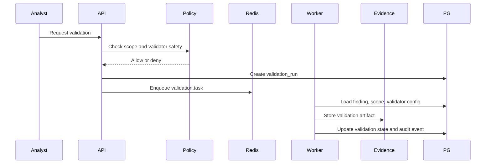

### Limitations

- Validation cannot prove exploitability in all cases.
- Some checks need credentials or client-specific context.
- Intrusive validation should remain a manual, explicitly approved workflow.

### Security Implications

- Validators are the highest-risk service class.
- Require egress restrictions, audit, rate limits, and kill switches.
- Never allow LLMs to generate validator actions.

## Threat Model

### Assets

- Raw evidence and secrets.
- Client scope definitions.
- Attack paths and vulnerability findings.
- Credentials used for authenticated testing.
- Graph relationships revealing trust and architecture.
- Audit logs and authorization records.

### Threat Actors

- External attacker targeting Lattice9.
- Malicious or careless tenant user.
- Compromised operator account.
- Poisoned target content attempting parser or prompt injection.
- Compromised scanner container.
- Insider with excessive evidence access.

### Key Threats And Controls

| Threat | Risk | Controls |
| --- | --- | --- |
| Unauthorized scanning | Legal and client harm | Scope gate, authorization records, active action approvals |
| Evidence exfiltration | Client data loss | Encryption, RBAC, download audit, redaction |
| Graph poisoning | Bad reasoning and hidden risk | Evidence requirements, source weighting, manual merge audit |
| Prompt injection | LLM summaries mislead analysts | LLMs cannot mutate facts, citation enforcement, evidence sandboxing |
| SSRF through validators | Infrastructure abuse | Egress allowlists, scope policy, network sandbox |
| Cross-tenant leakage | Severe confidentiality breach | Tenant IDs on all rows, RLS, graph partitioning |
| Scanner container compromise | Host compromise | Container isolation, no host mounts, network policies |
| False suppression | Real issue hidden | Suppression audit, peer review for accepted false positives |
| Report tampering | Loss of credibility | Evidence hashes, immutable audit, signed exports |

## Security Hardening Strategy

### Data Isolation

- Use PostgreSQL row-level security by `tenant_id`.
- Partition Neo4j by database or strict tenant label and query guards.
- Use per-tenant object storage prefixes and encryption keys.

### Secrets

- Store scanner credentials in a vault, not PostgreSQL.
- Pass short-lived credentials to workers.
- Redact secrets from previews.
- Record access to secret-backed evidence.

### Worker Isolation

- Run collection and validation in separate networks.
- Use minimal container images.
- Disable privileged containers.
- Use egress allowlists and rate limits.
- Apply job-level timeouts and resource quotas.

### Application Security

- Keep authorization checks server-side.
- Validate every ID belongs to tenant and engagement.
- Use signed URLs for evidence previews.
- Sanitize rendered evidence.
- Require MFA for export and validation permissions.

### AI Safety Boundary

- LLM service is advisory only.
- LLM outputs are stored as `advisory`.
- LLM must receive selected evidence snippets, not full raw artifact stores by default.
- LLM summaries must cite evidence IDs.
- No LLM-created findings, validators, scope changes, or active jobs.

## Scaling Strategy

### PostgreSQL

- Partition high-volume tables by engagement and month.
- Index canonical keys, entity type, relationship tuples, validation state, and timestamps.
- Use JSONB for attributes but promote frequently queried fields to columns.
- Add read replicas for UI queries.

### Neo4j

- Keep graph projection per engagement or tenant.
- Project only reasoning-relevant edges.
- Rebuild projection from PostgreSQL when needed.
- Cache common neighborhoods and path results.

### Redis

- Use separate streams per workload class.
- Tune consumer groups by collection type.
- Store long payloads in object storage.
- Monitor pending entries and dead-letter volume.

### Object Storage

- Content-addressed artifact layout:
  - `tenant/{tenant_id}/engagement/{engagement_id}/sha256/{hash}`
- Lifecycle cold artifacts.
- Keep metadata in PostgreSQL.

### Reasoning

- Run path recomputation incrementally on changed graph neighborhoods.
- Precompute centrality and trust-zone partitions asynchronously.
- Cap path depth and fan-out per engagement profile.
- Use approximate algorithms for very large graphs, then refine top candidates.

## Data Flow Diagrams

### End-To-End Intelligence Flow

```mermaid
flowchart LR
    A["Authorized scope"] --> B["Collection run"]
    B --> C["Raw evidence"]
    C --> D["Normalized observations"]
    D --> E["Resolved entities"]
    E --> F["Typed relationships"]
    F --> G["Graph projection"]
    G --> H["Temporal diff"]
    G --> I["Attack path inference"]
    H --> I
    I --> J["Validation"]
    J --> K["Ranked path queue"]
    K --> L["Analyst decision"]
    L --> M["Replayable report"]
```

### Evidence-To-Claim Flow

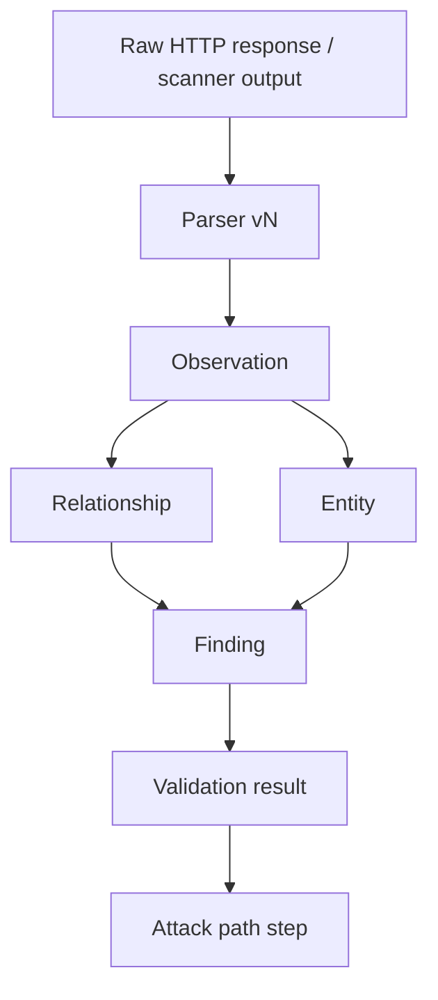

### Temporal Re-Ranking Flow

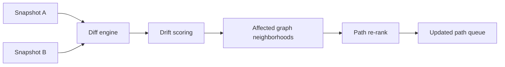

## Professional Roadmap

### Phase 0: Kill The Wrong Abstractions

- Remove LLM-created authoritative findings.
- Remove fake path examples from UI.
- Replace cyberpunk/card-heavy presentation with dense tables.
- Stop treating graph as visualization output.
- Introduce evidence IDs everywhere findings appear.

### Phase 1: Data Ownership Foundation

- Migrate MySQL Drizzle schema to PostgreSQL.
- Add evidence, observation, relationship, validation, snapshot, and attack path tables.
- Add object storage service.
- Add Redis Streams.
- Add tenant and engagement IDs to every operational record.

### Phase 2: Normalization And Evidence

- Implement parser registry.
- Store raw artifacts and parser outputs.
- Build entity observations and relationship observations.
- Add evidence browser and lineage view.
- Add immutable audit events.

### Phase 3: Correlation And Graph Projection

- Implement entity resolution.
- Implement relationship inference.
- Add Neo4j projection service.
- Build graph neighborhood API.
- Add duplicate finding clusters.

### Phase 4: Temporal Memory

- Implement graph snapshots.
- Implement temporal diffs.
- Add drift scoring.
- Add entity and finding timelines.
- Trigger path re-ranking on drift.

### Phase 5: Attack-Chain Inference

- Implement rule registry.
- Implement path planner and confidence engine.
- Persist attack paths and steps.
- Build path trace UI.
- Add rejection reasons.

### Phase 6: Validation And False Positive Suppression

- Implement validator registry and safety policy.
- Add validation queue.
- Add validation state transitions.
- Add environmental relevance scoring.
- Require validation for high-priority path promotion.

### Phase 7: Operational Hardening

- Enforce row-level security.
- Add vault-backed credentials.
- Add worker sandboxing and egress policies.
- Add export controls and signed replay bundles.
- Add monitoring and audit dashboards.

### Phase 8: Advanced Intelligence

- Add identity-specific graph models.
- Add cloud control-plane relationship inference.
- Add authenticated environment importers.
- Add analyst-authored rules.
- Add cross-snapshot behavioral anomaly models.

## Migration Map From Current Repository

| Current File | Target Direction |
| --- | --- |
| `docker-compose.yml` | Replace MySQL with PostgreSQL; add Neo4j, Redis, and MinIO/S3-compatible object storage |
| `drizzle/schema.ts` | Replace `mysql-core` schema with PostgreSQL schema and normalized evidence/observation/path tables |
| `server/db.ts` | Replace broad helper functions with repository modules per aggregate: engagements, evidence, entities, findings, paths |
| `server/routers/vulnerability.ts` | Remove LLM-generated finding persistence; emit candidate observations and request deterministic validation |
| `server/routers/recon.ts` | Replace direct engine calls with collection run creation and Redis queue dispatch |
| `server-py/main.py` | Replace in-memory graph with worker services reading PostgreSQL/Neo4j and writing deterministic results |
| `shared/intelligence.ts` | Expand into versioned schema contracts for entities, relationships, evidence, paths, and validation |
| `client/src/pages/Lattice9Dashboard.tsx` | Replace all-in-one dashboard with workbench routes: assets, graph, paths, evidence, drift, validation |
| `client/src/index.css` | Remove cyberpunk/glow defaults; implement dense operational styling |

## Acceptance Criteria

Lattice9 is no longer an AI wrapper when:

- A persisted finding cannot exist without evidence.
- A persisted attack path cannot exist without graph relationships and a reasoning trace.
- Every scanner output is replayable through normalization.
- Every graph edge has evidence and confidence.
- Every path has rejection conditions.
- Temporal drift changes path ranking.
- LLM output is advisory and cited, never authoritative.
- UI workflows start from analyst decisions, not animations or dashboards.
- The system can reproduce why it believed something on a specific date.
